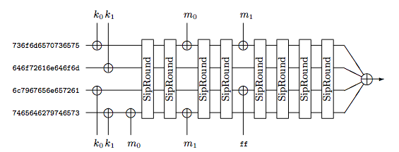
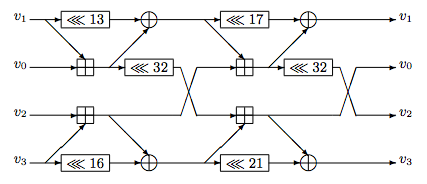

<%inherit file="basecomment.html"/>

<%block filter="filters.markdown">

[Siphash](https://131002.net/siphash/) is a
[PRF](https://en.wikipedia.org/wiki/Pseudorandom_function) using a
"SipRound" primitive as a building block.

The recommended SipHash variant, SipHash-2-4, is running two
*SipRounds* after every message block and four rounds at the end to
finalise the hash.

<div class="image"
style="height:252px;"><div>SipHash-2-4 processing a 15-byte message (<a href="https://131002.net/siphash/siphash.pdf">from the paper</a>)</div></div>


SipRound
---

SipRound is a simple construct - it mangles 256 bits of internal state
using just a few operations on 64 bit registers:

 * 4 bit rotations
 * 2 rotations by 32 bits
 * 4 xors
 * 4 additions


<div class="image"
style="height:224px;"><div>The ARX network of SipRound (<a href="https://131002.net/siphash/siphash.pdf">from the paper</a>)</div></div>


Here's an equivalent code in C
([from csiphash](https://github.com/majek/csiphash/blob/master/csiphash.c#L64)):

```.c
#define HALF_ROUND(a,b,c,d,s,t)                 ${"\\"}
        a += b; c += d;                         ${"\\"}
        b = ROTATE(b, s) ^ a;                   ${"\\"}
        d = ROTATE(d, t) ^ c;                   ${"\\"}
        a = ROTATE(a, 32);

#define SIPROUND(v0,v1,v2,v3)                   ${"\\"}
        HALF_ROUND(v0,v1,v2,v3,13,16);          ${"\\"}
        HALF_ROUND(v2,v1,v0,v3,17,21);
```


Differential cryptanalysis
----

In order to visualise the SipRound we'll do a basic
[differential cryptanalysis](https://en.wikipedia.org/wiki/Differential_cryptanalysis). It
works like that:

 * First we generate random 256 bits of state and run a SipRound on it. We get 256 bits result back.
 * Next, we take the initial state again, modify a single bit and count SipRound on the modified state. We get another 256 bit result.

Now we have two 256-bit results of a SipRound. The input data was very
similar, with only a single bit flipped, the results will also be
pretty close.

Visualising SipRound
---

Here are the results visualised. Every row represents a particular bit
flipped. In row number 0 we flipped 0th bit, row 255 flip 255th
bit. In every row we draw 256 points - one for every bit of the
difference between the SipRound results (xor).

The pixel colour represents the probability of a bit being flipped in
the SipRound results. Red means the bit is always flipped, dark grey -
the bit is often flipped, white - the bit is always the same.


<gnuplot>
size: 600x550
xsize: 1200x1100
--
set lmargin at screen 0.05
set rmargin at screen 0.88
set bmargin at screen 0.05
set tmargin at screen 0.98

set border 0;
set yrange [255:0];
set xrange [0:255];

set xtics nomirror;
set ytics nomirror;

set xtics 32
set mxtics 8
set ytics 32
set mytics 8


set pm3d map
set pm3d corners2color c3

set palette defined (0 "white", 0.80 "black", 1 "red")

splot "sipround-rows.tsv"  u 2:1:3 with pm3d
</gnuplot>


To read this chart pick a single row, say row number 0. Take a look at
the pixel colours in this line. Red pixels mean that particular bits
will always be flipped when modified 0th bit. Grey means that bits
will be flipped sometimes - depending on other bits of SipRound state.

For example, if we flipped 0th bit in a random initial state and run
SipRound on it, bits number 32, 64, 81, 160 and 224 will always be
flipped - they are red on the chart. After each of those there is a
trail of bits that may or may not be flipped depending on state.

If you wish to put that in code, here's a program printing differences
in SipRound results when flipping a single bit:

```.c
int bit = 0;

uint64_t v1[4], v2[4];
int j;

while (1) {
        fill_random(v1, sizeof(v1));
        memcpy(v2, v1, sizeof(v1));

        v1[bit/64] |=  (1ULL << (bit%64));
        v2[bit/64] &= ~(1ULL << (bit%64));

        SIPROUND(v1[0], v1[1], v1[2], v1[3]);
        SIPROUND(v2[0], v2[1], v2[2], v2[3]);

        for (j=0; j < 256; j++)
                if ((v1[j/64] ^ v2[j/64]) & (1ULL << (j%64)))
                        printf("%i ", j);
        printf("\n");
}
```

When flipping 0th bit (`bit = 0`) it print many numbers but bits
32,64, 81, 160 and 224 are always going to be flipped:

```
32 64 81 82 160 224 
32 33 34 35 36 64 65 81 160 161 224 225 226 227 228 
32 33 64 65 66 81 160 161 162 224 225 
32 64 65 67 81 82 83 84 160 161 163 224 
32 33 34 64 65 66 81 82 160 161 162 224 225 226 
32 64 81 160 224 
32 64 65 66 67 81 82 160 161 162 163 224 
32 33 64 65 81 160 161 224 225 
32 64 81 160 224 
32 64 66 81 82 83 84 160 162 224 
```

Bit 191
---

An astute reader will notice that the row 191 is unusual. Here's an
enlarged chart:

<gnuplot>
size: 600x130
--
set lmargin at screen 0.05
set rmargin at screen 0.88
set bmargin at screen 0.30
set tmargin at screen 0.98

set border 0;
set yrange [194:189];
set xrange [0:255];

set xtics nomirror;
set ytics nomirror;

set xtics 32
set mxtics 8
set ytics 1


set pm3d map
set pm3d corners2color c3

set palette defined (0 "white", 0.80 "black", 1 "red")

splot "sipround-rows.tsv"  u 2:1:3 with pm3d
</gnuplot>


Flipping bit 191 has always fully predictable result. It always just
flips a number of the internal state, not depending on the state.

Re-running the program with `bit=191` confirms it:

```
63 127 159 212 255 
63 127 159 212 255 
63 127 159 212 255 
63 127 159 212 255 
63 127 159 212 255 
63 127 159 212 255 
63 127 159 212 255 
63 127 159 212 255 
63 127 159 212 255 
63 127 159 212 255 
```

I don't think this affects SipHash security, still, it's interesting.


Two SipRounds
---

The plot for two SipRounds doesn't reveal anything new - it's looks
like a more packed previous chart:

<gnuplot>
size: 600x550
xsize: 1200x1100
--
set lmargin at screen 0.05
set rmargin at screen 0.88
set bmargin at screen 0.05
set tmargin at screen 0.98

set border 0;
set yrange [255:0];
set xrange [0:255];

set xtics nomirror;
set ytics nomirror;

set xtics 32
set mxtics 8
set ytics 32
set mytics 8


set pm3d map
set pm3d corners2color c3

set palette defined (0 "white", 0.80 "black", 1 "red")

splot "sipround2x-rows.tsv"  u 2:1:3 with pm3d
</gnuplot>


Three SipRounds
---

Three runs of SipRound make the chart much more "grey". That is: the
probability of flipping a single bit gets very close to 50% - what
you'd expect from a decent hash.

<gnuplot>
size: 600x550
xsize: 1200x1100
--
set lmargin at screen 0.05
set rmargin at screen 0.88
set bmargin at screen 0.05
set tmargin at screen 0.98

set border 0;
set yrange [255:0];
set xrange [0:255];

set xtics nomirror;
set ytics nomirror;

set xtics 32
set mxtics 8
set ytics 32
set mytics 8

set pm3d map
set pm3d corners2color c3

set palette defined (0 "white", 0.80 "black", 1 "red")

splot "sipround3x-rows.tsv"  u 2:1:3 with pm3d
</gnuplot>


Four SipRounds
---

The results of four rounds of SipHash on any data should be close to
being indistinguishable from a random data. The chart is almost
perfectly "grey", but still some delicate patterns are present. Notice
the adjusted scale.

<gnuplot>
size: 600x550
xsize: 1200x1100
--
set lmargin at screen 0.05
set rmargin at screen 0.88
set bmargin at screen 0.05
set tmargin at screen 0.98

set border 0;
set yrange [255:0];
set xrange [0:255];

set xtics nomirror;
set ytics nomirror;

set xtics 32
set mxtics 8
set ytics 32
set mytics 8

set pm3d map
set pm3d corners2color c3

set palette defined (0 "white", 0.80 "black", 1 "red")
#set palette defined (0 "green", 0.5 "white", 1 "red")

splot "sipround4x-rows2.tsv"  u 2:1:3 with pm3d
</gnuplot>

Interestingly the authors of the paper haven't noticed any patterns in 4 SipRounds:

> After three iterations of SipRound many biases are found. But after four or more iterations we did not detect any bias after experimenting with sets of 2^30 samples.

For the record, the charts above were generated by averaging the
results of 200000 samples in each row.

Finally, as the authors notice, it's not enough to notice a thin bias in four SipRounds - a practical attack needs to defeat six rounds:

> To attempt to distinguish our fast proposal SipHash-2-4 by exploiting such statistical biases, one needs to find a bias on six rounds [...]


</%block>
