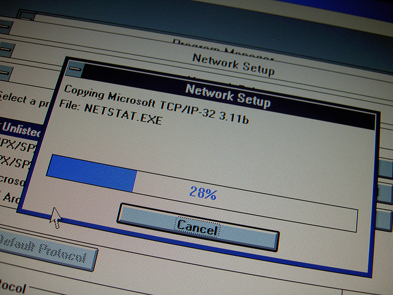

<%inherit file="basecomment.html"/>

<%block filter="filters.markdown">

-------------

I've published an article on the CloudFlare blog:

 * [https://blog.cloudflare.com/cloudflare-interview-questions/](https://blog.cloudflare.com/cloudflare-interview-questions/)

-------------

<% x ="""
CloudFlare interview questions
------------------------------

For quite some time we've been grilling our candidates about dirty
corners of TCP/IP stack. Every engineer here must know all the
nitty-gritty details about networks. For example: what are the
differences in checksumming algorithms between IPv4 and
IPv6 stacks?

<a href="https://www.flickr.com/photos/dbreg2007/4376127852">CC Daan Berg</a>

I'm joking. In spirit of
[the old TCP/IP pub game](http://valerieaurora.org/tcpip.html) I want
to share some of the TCP/IP quirks I bumped into over last few months.

Don't worry if you don't know the correct answer - you may always come
up with a funny one!

Some of the questions are fairly obvious, some don't have a direct
answer and are supposed to provoke a longer discussion. The goal to
encourage our dear readers to review the dusted RFCs, get interested
in inner workings of the network stack and generally spread the
knowledge about the protocols we so much rely on. We don't plan to
follow up with responses - that's for you to figure out. Don't forget
to add a comment below if you want to share a response :)

You think you know all about TCP/IP? Let's find out.

${ "##" } Archaeology

4. What is the lowest TCP port number?

4. TCP frame has an URG pointer field, when is it used?

9. Can the RST packet have a payload?

2. When flow field in IPv6 is being used?

2. What IP_FREEBIND socket option does?

${ "##" } Forgotten quirks

12. What does PSH flag actually do?

15. TCP timestamp is implicated in SYN cookies. How?

6. Can a "UDP" packet have a checksum field set to zero?

12. How does TCP simultaneous open work? Does it actually work?

${ "##" } Fragmentation and congestion

1. What is stupid window syndrome?

16. What are CWE and ECE flags in TCP header?

1. What is IP ID field and what does it have to do with DF bit? Why
some packets may have non-zero IP ID and a DF set?

${ "##" } Fresh ideas

10. Can SYN packet have a payload? (hint: new RFC proposals)

11. Can SYN+ACK packet have a payload?

${ "##" } ICMP path MTU

5. ICMP packet-too-big messages are returned by routers, their payload
contains a part of the original packet. What is the minimal length of
this payload that is be accepted by Linux?

14. When ICMP packet-too-big message is returned by an intermediate
router it will have a source IP of that router. In practice though, we
often see a source IP of the ICMP message to be identical to the
destination IP of the original packet. Why could that happen?

${ "##" } Linux configuration

7. Linux has a "tcp_no_metrics_save" sysctl setting. What does it save and
for how long.

11. Linux uses two queues to handle incoming TCP connections: SYN
queue and accept queue.  What is the length of the SYN queue?

13. What happens if SYN queue grows too large and overflows?

${ "##" } Touching the router

8. What are BGP bogons, and why are they less of a problem now.

9. TCP has an extension which adds MD5 checksums to packets. When is
it useful?

And finally:

- What are the differences in checksumming algorithms in IPv4 and IPv6?

At CloudFlare we touch low level things like that every day. Is this
something that interests you? Consider
[applying](https://www.cloudflare.com/join-our-team)!

""" %>

</%block>

