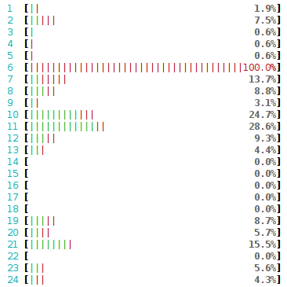
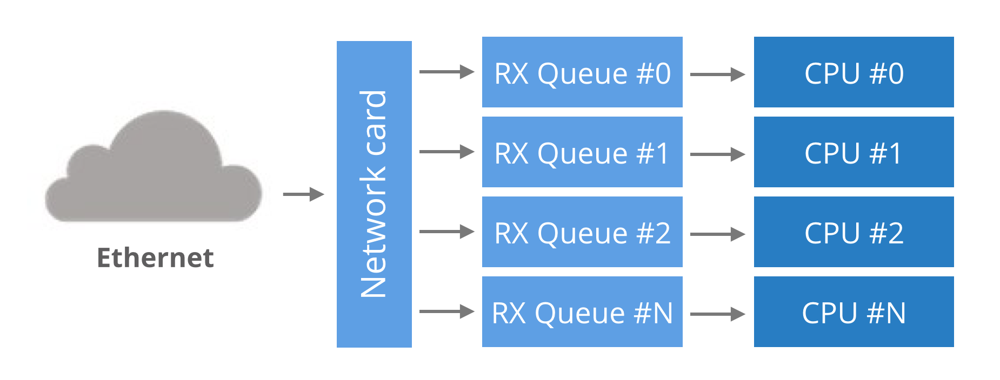
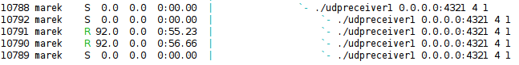

<%inherit file="basecomment.html"/>

<%block filter="filters.markdown">

-------------

I've published an article on the CloudFlare blog:

 * [https://blog.cloudflare.com/how-to-receive-a-million-packets/](https://blog.cloudflare.com/how-to-receive-a-million-packets/)


-------------


<% a = '''
Last week during a casual conversation, I caught my colleague saying:
"Linux network stack is slow! You can't expect it to do anything more
than 50 thousand packets per second per core!"

That got me thinking. While I agree that 50k pps per core is probably
the limit for any practical application, what _is_ Linux networking
stack capable of? Let's rephrase to make it more fun:

> How hard is it to make an application on Linux receive 1 million UDP
> packets per second?

Hopefully, answering this question will be a good lesson about the
design of a modern networking stack.


First, let us assume:

* Measuring packets per second (pps) is much more interesting than measuring bytes
  per second (bps). You can achieve high bps by better pipelining and
  sending longer packets. Improving pps is much harder.

* Since we're interested in PPS, our experiments will use short UDP
  messages. To be precise: 32 bytes of UDP payload. This means 74
  bytes on ethernet layer.

* For the experiments we will use two physical servers: "receiver" and
  "sender".

* They both have two six core 2GHz Xeon processors. With hyper
  threading (HT) enabled that counts to 24 processors on each box. The
  boxes have a multi-queue 10G network card by Solarflare, with 11
  receive queues configured. More on that later.

* The source code of the test programs is available: [`udpsender`](https://github.com/majek/dump/blob/master/how-to-receive-a-million-packets/udpsender.c), [`udpreceiver`](https://github.com/majek/dump/blob/master/how-to-receive-a-million-packets/udpreceiver1.c).


Before we begin
----------

Let's use the port 4321 for our UDP packets. Before we start we must
ensure the traffic won't be interfered with by the `iptables`:

```.bash
receiver$ iptables -I INPUT 1 -p udp --dport 4321 -j ACCEPT
receiver$ iptables -t raw -I PREROUTING 1 -p udp --dport 4321 -j NOTRACK
```

A couple of explicitly defined IP addresses will later become handy:

```.bash
receiver$ for i in `seq 1 20`; do ${"\\"}
              ip addr add 192.168.254.$i/24 dev eth2; ${"\\"}
          done
sender$ ip addr add 192.168.254.30/24 dev eth3
```

1. The naive approach
---------------

For the start let's do the simplest experiment. How many packets will
be delivered for a naive send and receive?

The sender pseudo code:

```.python
fd = socket.socket(socket.AF_INET, socket.SOCK_DGRAM)
fd.bind(("0.0.0.0", 65400)) # select source port to reduce nondeterminism
fd.connect(("192.168.254.1", 4321))
while True:
    fd.sendmmsg(["\x00" * 32] * 1024)
```

While we could have used the usual `send` syscall, it wouldn't be
efficient. Context switches to the kernel have a cost and it is be
better to avoid it. Fortunately a handy syscall was recently added to
Linux:
[`sendmmsg`](http://man7.org/linux/man-pages/man2/sendmmsg.2.html). It
allows us to send many packets in one go. Let's do 1024 packets at
once.

The receiver pseudo code:

```.python
fd = socket.socket(socket.AF_INET, socket.SOCK_DGRAM)
fd.bind(("0.0.0.0", 4321))
while True:
    packets = [None] * 1024
    fd.recvmmsg(packets, MSG_WAITFORONE)
```

Similarly,
[`recvmmsg`](http://man7.org/linux/man-pages/man2/recvmmsg.2.html) is
a more efficient version of the common `recv` syscall.


Let's try it out:

```.bash
sender$ ./udpsender 192.168.254.1:4321
receiver$ ./udpreceiver1 0.0.0.0:4321
  0.352M pps  10.730MiB /  90.010Mb
  0.284M pps   8.655MiB /  72.603Mb
  0.262M pps   7.991MiB /  67.033Mb
  0.199M pps   6.081MiB /  51.013Mb
  0.195M pps   5.956MiB /  49.966Mb
  0.199M pps   6.060MiB /  50.836Mb
  0.200M pps   6.097MiB /  51.147Mb
  0.197M pps   6.021MiB /  50.509Mb
```

With the naive approach we can do between 197k and 350k pps. Not too
bad. Unfortunately there is quite a bit of variability. It is caused
by the kernel shuffling our programs between cores. Pinning the
processes to CPUs will help:

```.bash
sender$ taskset -c 1 ./udpsender 192.168.254.1:4321
receiver$ taskset -c 1 ./udpreceiver1 0.0.0.0:4321
  0.362M pps  11.058MiB /  92.760Mb
  0.374M pps  11.411MiB /  95.723Mb
  0.369M pps  11.252MiB /  94.389Mb
  0.370M pps  11.289MiB /  94.696Mb
  0.365M pps  11.152MiB /  93.552Mb
  0.360M pps  10.971MiB /  92.033Mb
```

Now, the kernel scheduler keeps the processes on the defined
CPUs. This improves processor cache locality and makes the numbers
more consistent, just what we wanted.


2. Send more packets
-------------

While 370k pps is not bad for a naive program, it's still quite far
from the goal of 1M pps. To receive more, first we must send more
packets. How about sending independently from two threads:

```.bash
sender$ taskset -c 1,2 ./udpsender ${ "\\" }
            192.168.254.1:4321 192.168.254.1:4321
receiver$ taskset -c 1 ./udpreceiver1 0.0.0.0:4321
  0.349M pps  10.651MiB /  89.343Mb
  0.354M pps  10.815MiB /  90.724Mb
  0.354M pps  10.806MiB /  90.646Mb
  0.354M pps  10.811MiB /  90.690Mb
```

The numbers on the receiving side didn't increase. `ethtool -S` will
reveal where the packets actually went:

```.bash
receiver$ watch 'sudo ethtool -S eth2 |grep rx'
     rx_nodesc_drop_cnt:    451.3k/s
     rx-0.rx_packets:     8.0/s
     rx-1.rx_packets:     0.0/s
     rx-2.rx_packets:     0.0/s
     rx-3.rx_packets:     0.5/s
     rx-4.rx_packets:  355.2k/s
     rx-5.rx_packets:     0.0/s
     rx-6.rx_packets:     0.0/s
     rx-7.rx_packets:     0.5/s
     rx-8.rx_packets:     0.0/s
     rx-9.rx_packets:     0.0/s
     rx-10.rx_packets:    0.0/s
```

Through these stats, the NIC reports that it had successfully
delivered around 350k pps to RX queue number #4. The
`rx_nodesc_drop_cnt` is a Solarflare specific counter saying the NIC
failed to deliver 450k pps to the kernel.

Sometimes it's not obvious why the packets weren't delivered. In our
case though, it's very clear: the RX queue #4 delivers packets to
CPU #4. And CPU #4 can't do any more work - it's totally busy by just
reading the 350k pps. Here's how it looks in `htop`:

<div class="image"><div></div></div>


${ "###" } Crash course to multi-queue NIC's

Historically network cards had a single RX queue that was being used to
pass packets between hardware and kernel. This design had an obvious
limitation - it was impossible to deliver more packets than a single
CPU could handle.

To utilize multicore systems NICs began to support multiple RX
queues. The design is simple: each RX queue is pinned to a separate
CPU, therefore, by delivering packets to all the RX queues a NIC can
utilize all CPUs. But it raises a question: given a packet, how does
the NIC decide to which RX queue to push it?

<div class="image"><div></div></div>

Round-robin balancing is not acceptable, as it might introduce
reordering of packets within a single connection. An alternative is to
use a hash from packet to decide the RX queue number. The hash is
usually counted from a tuple (src IP, dst IP, src port, dst
port). This guarantees that packets for a single flow will always end
up on exactly the same RX queue, and reordering of packets within a
single flow can't happen.

In our case the hash could have been counted like:

```.bash
RX_queue_number = hash('192.168.254.30', '192.168.254.1', 65400, 4321) % number_of_queues
```


${ "###" } Multi-queue hashing algorithms

This hash algorithm is configurable with `ethtool`. On our setup it
is:

```.bash
receiver$ ethtool -n eth2 rx-flow-hash udp4
UDP over IPV4 flows use these fields for computing Hash flow key:
IP SA
IP DA
```

This reads as: for `udp4` packets, the NIC will hash (src IP, dst IP)
addresses. Ie:

```.bash
RX_queue_number = hash('192.168.254.30', '192.168.254.1') % number_of_queues
```

This is pretty limited, as it ignores the port numbers. Many NIC's
allow to customize the hash. Again, using `ethtool` we can select (src
IP, dst IP, src port, dst port) tuple as hash:

```.bash
receiver$ ethtool -N eth2 rx-flow-hash udp4 sdfn
Cannot change RX network flow hashing options: Operation not supported
```

Unfortunately our NIC doesn't support it - we are constrained to (src
IP, dst IP) hashing.


${ "###" } A note on NUMA performance

So far all our packets flow to only one RX queue and hit only one
CPU. Let's use this as an opportunity to benchmark the performance of
different CPUs. In our setup the receiver host has two separate
processor banks, each is a different
[NUMA node](https://en.wikipedia.org/wiki/Non-uniform_memory_access).

We can pin the single-threaded receiver to one of four interesting
CPUs in our setup. The four options are:

1. Run receiver on another CPU, but on the same NUMA node as the RX
queue. The performance as we saw above is around 360k pps.

2. With receiver is on exactly same CPU as the RX queue we can get up
to ~430k pps. But it creates high variability. The performance drops
down to zero if the NIC is overwhelmed with packets.

3. When the receiver runs on the HT counterpart of the CPU handling RX
queue, the performance is half the usual numbers at around 200k pps.

4. With receiver on a CPU on a different NUMA node than the RX queue
we get ~330k pps. The numbers aren't too consistent though.


While 10% of penalty for running on different NUMA node may not sound
too bad, the problem only gets worse with scale. On some tests I was
able to squeeze out only 250k pps per core. On all the cross-NUMA
tests the variability was bad. The performance penalty across NUMA
nodes is even more visible at higher throughput. In one of the tests I
got 4x penalty by when running the receiver on a bad NUMA node.


3. Multiple receive IP's
------------

Since the hashing algorithm on our NIC is pretty limited, the only way
to distribute the packets across RX queues is to use many IP
addresses. Here's how to send packets to different destination IP's:

```.bash
sender$ taskset -c 1,2 ./udpsender 192.168.254.1:4321 192.168.254.2:4321
```

`ethtool` confirms the packets go to distinct RX queues:

```.bash
receiver$ watch 'sudo ethtool -S eth2 |grep rx'
     rx-0.rx_packets:     8.0/s
     rx-1.rx_packets:     0.0/s
     rx-2.rx_packets:     0.0/s
     rx-3.rx_packets:  355.2k/s
     rx-4.rx_packets:     0.5/s
     rx-5.rx_packets:  297.0k/s
     rx-6.rx_packets:     0.0/s
     rx-7.rx_packets:     0.5/s
     rx-8.rx_packets:     0.0/s
     rx-9.rx_packets:     0.0/s
     rx-10.rx_packets:    0.0/s
```

The receiving part:

```.bash
receiver$ taskset -c 1 ./udpreceiver1 0.0.0.0:4321
  0.609M pps  18.599MiB / 156.019Mb
  0.657M pps  20.039MiB / 168.102Mb
  0.649M pps  19.803MiB / 166.120Mb
```

Hurray! With two cores busy with handling RX queues, and third running
the application, it's possible to get ~650k pps!

We can increase this number further by sending traffic to three or
four RX queues, but soon the application will hit another limit. This
time the `rx_nodesc_drop_cnt` is not growing, but the `netstat`
"receiver errors" are:

```.bash
receiver$ watch 'netstat -s --udp'
Udp:
      437.0k/s packets received
        0.0/s packets to unknown port received.
      386.9k/s packet receive errors
        0.0/s packets sent
    RcvbufErrors:  123.8k/s
    SndbufErrors: 0
    InCsumErrors: 0
```

This means that while NIC is able to deliver the packets to the
kernel, the kernel is not able to deliver the packets to the
application. In our case it is able to deliver only 440k pps, the
remaining 390k pps + 123k pps are dropped due to the application not
receiving them fast enough.


4. Receive from many threads
----------------

We need to scale out the receiver application. The naive approach, to
receive from many threads, won't work well:

```.bash
sender$ taskset -c 1,2 ./udpsender 192.168.254.1:4321 192.168.254.2:4321
receiver$ taskset -c 1,2 ./udpreceiver1 0.0.0.0:4321 2
  0.495M pps  15.108MiB / 126.733Mb
  0.480M pps  14.636MiB / 122.775Mb
  0.461M pps  14.071MiB / 118.038Mb
  0.486M pps  14.820MiB / 124.322Mb
```

The receiving performance is down compared to a single threaded
program. It's caused by a lock contention on the UDP receive buffer
side. Since both threads are using the same socket descriptor, they
spend disproportionate amount of time on fighting for a lock around
the UDP receive buffer.
[This paper](http://www.jcc2014.ucm.cl/jornadas/WORKSHOP/WSDP%202014/WSDP-4.pdf)
describes the problem in more details.

Using many threads to receive from a single descriptor is not optimal.


5. SO_REUSEPORT
-------------

Fortunately, there is a workaround recently added to Linux:
[the SO_REUSEPORT flag](https://lwn.net/Articles/542629/). When this
flag is set on a socket descriptor, Linux will allow many processes to
bind to a the same port. In fact, any number of processes will be
allowed to bind and the load will be spread across them.

With `SO_REUSEPORT` each of the processes will have a separate socket
descriptor. Therefore each will own a dedicated UDP receive
buffer. This avoid the contention issues previously encountered:

```.bash
receiver$ taskset -c 1,2,3,4 ./udpreceiver1 0.0.0.0:4321 4 1
  1.114M pps  34.007MiB / 285.271Mb
  1.147M pps  34.990MiB / 293.518Mb
  1.126M pps  34.374MiB / 288.354Mb
```

This is more like it! The throughput is decent now!

More investigation will reveal further room for improvement. Even
though we started four receiving threads, the load is not being spread
evenly across them:

<div class="image"><div></div></div>

Two threads received all the work and the other two got no packets at
all. This is caused by the hashing collision, but this time it is on
the `SO_REUSEPORT` layer.


Final words
--------

I've done some further tests, and with perfectly aligned RX queues
and receiver threads on a single NUMA node it was possible to get 1.4M
pps. Running receiver on different NUMA node caused the numbers to
drop achieving at best 1M pps.

To sum up, if you want a perfect performance you need to:

 - Ensure traffic is distributed evenly across many RX queues and
   `SO_REUSEPORT` processes. In practice the load usually is well
   distributed as long as there is a large number of connections (or
   flows).

 - You need to have enough spare CPU capacity to actually pick up the
   packets from the kernel.

 - To make the things harder, both RX queues and receiver processes
   should be on a single NUMA node.


While we had shown that it is technically possible to receive 1M pps
on a Linux machine, the application was a not doing any actual
processing of received packets - it haven't even looked at the content
of the traffic. Don't expect performance like that for any practical
application.

''' %>
</%block>


