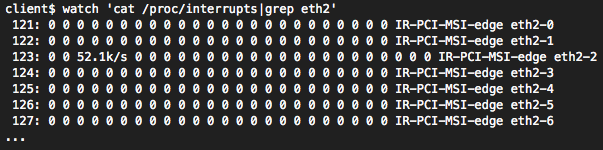

<%inherit file="basecomment.html"/>

<%block filter="filters.markdown">


-------------

I've published an article on the CloudFlare blog:

 * [https://blog.cloudflare.com/how-to-achieve-low-latency/](https://blog.cloudflare.com/how-to-achieve-low-latency/)


-------------

<% a = """

Optimizing 10Gb NICs for latency
================================

In [a recent blog post](https://blog.cloudflare.com/how-to-receive-a-million-packets/) we explained how to tweak a simple UDP application to maximize throughput. This time we are going to optimize our UDP application for latency. Fighting with latency is a great excuse to discuss modern features of multiqueue NICs. Some of the techniques covered here are also discussed in [`scaling.txt` kernel document](https://www.kernel.org/doc/Documentation/networking/scaling.txt).


<div class="image"><div>
<small>CC BY-SA 2.0 <a href="https://www.flickr.com/photos/hktang/4243300265/">image</a> by Xiaojun Deng</small>
</div></div>

Our experiment will be setup up as follows:

 * We will have two physical Linux hosts: the 'client' and the 'server'. They communicate with a simple UDP echo protocol.
 * Client sends a small UDP frame (32 bytes of payload) and waits for the reply, measuring the round trip time (RTT). Server echoes back the packets immediately after they are received.
 * Both hosts have 2GHz Xeon CPU's, with two sockets of 6 cores and Hyper Threading (HT) enabled - that counts to 24 CPUs per host.
 * The client has a Solarflare 10Gb, the server Intel 82599 10Gb NIC. Both cards have a fiber connected to a 10Gb switch.
 * We're going to measure the round trip time. Since the numbers are pretty small, there is a lot of jitter when counting the averages. Instead, it makes more sense to take a stable value - the lowest RTT from many runs done over one second.
 * As usual, code used here is available on GitHub: [`udpclient.c`](https://github.com/majek/dump/blob/master/how-to-receive-a-packet/udpclient.c), [`udpserver.c`](https://github.com/majek/dump/blob/master/how-to-receive-a-packet/udpserver.c).


Prerequisites
============

First, let's explicitly assign the IP addresses:

```.bash
client$ ip addr add 192.168.254.1/24 dev eth2
server$ ip addr add 192.168.254.30/24 dev eth3
```

Make sure `iptables` and `conntrack` don't interfere with our traffic:

```.bash
client$ iptables -I INPUT 1 --src 192.168.254.0/24 -j ACCEPT
client$ iptables -t raw -I PREROUTING 1 --src 192.168.254.0/24 -j NOTRACK
server$ iptables -I INPUT 1 --src 192.168.254.0/24 -j ACCEPT
server$ iptables -t raw -I PREROUTING 1 --src 192.168.254.0/24 -j NOTRACK
```

Finally, ensure the interrupts of multiqueue network cards are evenly distributed between CPUs. The `irqbalance` service is stopped and the interrupts are manually assigned. For simplicity let's pin the RX queue #0 to CPU #0, RX queue #1 to CPU #1 and so on.

```.bash
client$ (let CPU=0; cd /sys/class/net/eth2/device/msi_irqs/;
         for IRQ in *; do
            echo $CPU > /proc/irq/$IRQ/smp_affinity_list
            let CPU+=1
         done)
server$ (let CPU=0; cd /sys/class/net/eth3/device/msi_irqs/;
         for IRQ in *; do
            echo $CPU > /proc/irq/$IRQ/smp_affinity_list
            let CPU+=1
         done)
```

This scripts assign the interrupts fired by each RX queue to a selected CPU. Finally, some network cards have [Ethernet flow control](https://en.wikipedia.org/wiki/Ethernet_flow_control) enabled by default. In our experiment we won't push too many packets, so it shouldn't matter. In any case - it's unlikely the average user actually wants flow control - it can introduce unpredictable latency spikes during higher load:

```.bash
client$ sudo ethtool -A eth2 autoneg off rx off tx off
server$ sudo ethtool -A eth3 autoneg off rx off tx off
```

Naive round trip
-----

Here's the sketch of our client code. Nothing too fancy: send a packet and measure the time until we hear the response.

```.python
fd = socket.socket(socket.AF_INET, socket.SOCK_DGRAM)
fd.bind(("0.0.0.0", 65400)) # pin source port to reduce nondeterminism
fd.connect(("192.168.254.30", 4321))
while True:
    t1 = time.time()
    fd.sendmsg("\x00" * 32)
    fd.readmsg()
    t2 = time.time()
    print "rtt=%.3fus" % ((t2-t1) * 1000000)
```

The server is similarly uncomplicated. It waits for packets and echoes them back to the source:

```.python
fd = socket.socket(socket.AF_INET, socket.SOCK_DGRAM)
fd.bind(("0.0.0.0", 4321))
while True:
    data, client_addr = fd.recvmsg()
    fd.sendmsg(data, client_addr)
```

Let's run them:

```.bash
server$ ./udpserver
client$ ./udpclient 192.168.254.30:4321
[*] Sending to 192.168.254.30:4321, src_port=65500
pps= 16815 avg= 57.224us dev= 24.970us min=45.594us
pps= 15910 avg= 60.170us dev= 28.810us min=45.679us
pps= 15463 avg= 61.892us dev= 33.332us min=44.881us
```

In the naive run we're able to do around 15k round trips a second, with an average RTT of 60 microseconds (us) and minimal 44us. The standard deviation is pretty scary and suggests high jitter.

Kernel polling - SO_BUSY_POLL
-----------

Linux 3.11 added support for [`SO_BUSY_POLL` socket option](http://www.intel.com/content/dam/www/public/us/en/documents/white-papers/open-source-kernel-enhancements-paper.pdf). The idea is to ask the kernel to poll for incoming packets for [a given amount of time](http://man7.org/linux/man-pages/man7/socket.7.html). This of course increases the CPU usage on the machine, but will reduce the latency. The benefit comes from avoiding the major context switch when a packet is received. In our experiment enabling `SO_BUSY_POLL` brings down the min latency by 7us:


```.bash
server$ sudo ./udpserver  --busy-poll=50
client$ sudo ./udpclient 192.168.254.30:4321 --busy-poll=50
pps= 19440 avg= 49.886us dev= 16.405us min=36.588us
pps= 19316 avg= 50.224us dev= 15.764us min=37.283us
pps= 19024 avg= 50.960us dev= 18.570us min=37.116us
```

While I'm not thrilled by these numbers, there may be some valid use cases for `SO_BUSY_POLL`. To my understanding, as opposed to other approaches, it works well with the interrupt coalescing (`rx-usecs`).


Userspace busy polling
------------

Instead of doing polling in the kernel with `SO_BUSY_POLL`, we can just do it in the application. Let's avoid blocking on `recvmsg` and run a non-blocking variant in a busy loop. The server pseudo code will look like:

```.python
while True:
    while True:
        data, client_addr = fd.recvmsg(MSG_DONTWAIT)
        if data:
            break
    fd.sendmsg(data, client_addr)
```

This approach is surprisingly effective:

```.bash
server$ ./udpserver  --polling
client$ ./udpclient 192.168.254.30:4321 --polling
pps= 25812 avg= 37.426us dev= 11.865us min=31.837us
pps= 23877 avg= 40.399us dev= 14.665us min=31.832us
pps= 24746 avg= 39.086us dev= 14.041us min=32.540us
```

Not only the min time dropped by further 4us, but also the average and deviation look healthier.


Pin processes
-------

So far we allowed the Linux scheduler to allocate CPU for our busy polling applications. Some of the jitter came from the processes being moved around. Let's try pinning them to specific cores:

```.bash
server$ taskset -c 3 ./udpserver --polling
client$ taskset -c 3 ./udpclient 192.168.254.30:4321 --polling
pps= 26824 avg= 35.879us dev= 11.450us min=30.060us
pps= 26424 avg= 36.464us dev= 12.463us min=30.090us
pps= 26604 avg= 36.149us dev= 11.321us min=30.421us
```

This shaved off further 1us. Unfortunately running our applications on a "bad" CPU might actually degrade the numbers. To understand why we need to revisit how the packets are being dispatched across RX queues.


RSS - Receive Side Scaling
----------------

In [the previous article](https://blog.cloudflare.com/how-to-receive-a-million-packets/) we mentioned the NIC hashes packets in order to spread the load across many RX queues. This technique is called RSS - Receive Side Scaling. We can see it in action by observing the `/proc/net/softnet_stat` file with [the `softnet.sh` script](https://github.com/majek/dump/blob/master/how-to-receive-a-packet/softnet.sh):

<div class="image"></div>

This makes sense - since we send only one flow (connection) from the `udpclient`, all the packets hit the same RX queue. In this case it is RX queue #1, which is bound to CPU #1. Indeed, when we run the client on that very CPU the latency goes up by around 2us:

```.bash
client$ taskset -c 1 ./udpclient 192.168.254.30:4321  --polling
pps= 25517 avg= 37.615us dev= 12.551us min=31.709us
pps= 25425 avg= 37.787us dev= 12.090us min=32.119us
pps= 25279 avg= 38.041us dev= 12.565us min=32.235us
```

Turns out that keeping the process on the same core as arriving interrupts slightly degrades the latency. But how can the process know if it's running on the offending CPU?

One way is for the application to query the kernel. Kernel 3.19 introduced [`SO_INCOMING_CPU` socket option](https://lwn.net/Articles/619862/). With that the process can figure out to which CPU the packet was originally delivered.

An alternative approach is to ensure the packets will be dispatched only to the CPUs we want. We can do that by adjusting NIC settings with `ethtool`.

Indirection Table
---------------------

RSS is intended to distribute the load across RX queues. In our case, of the UDP flow, the RX queue is chosen by this formula:

```.txt
RX_queue = INDIR[hash(src_ip, dst_ip) % 128]
```

As discussed previously, the hash function for UDP flows is not configurable on Solarflares. Fortunately the `INDIR` table is!

But what is `INDIR` anyway? Well, it's an indirection table that maps the least significant bits of a hash to an RX queue number. To view the indirection table run `ethtool -x`:

<div class="image"></div>

This reads as: packets with hash equal to, say, 72 will go to RX queue #6, hash of 126 will go to RX queue #5, and so on.

This table can be configured. For example, to make sure all traffic goes only to CPU's #0-#5 (the first NUMA node in our setup), we run:

```.bash
client$ sudo ethtool -X eth2 weight 1 1 1 1 1 1 0 0 0 0 0
server$ sudo ethtool -X eth3 weight 1 1 1 1 1 1 0 0 0 0 0
```

The adjusted indirection table:

<div class="image"></div>

With that set up our latency numbers don't change much, but at least we are sure the packets will always hit only the CPUs on the first NUMA node. The lack of NUMA locality usually costs around 2us.

I should mention that Intel 82599 supports adjusting RSS hash function for UDP flows, but the driver does not support indirection table manipulation. To get it running I [used this patch](https://github.com/majek/ixgbe/commit/336d556cbada2974700f4d809b54ce472d11709d).


Flow steering
----------

There is also anther way to ensure packets hit specific CPU: flow steering rules. Flow steering rules are used to specify exceptions on top of the indirection table. They tell the NIC to send specific flow to specific RX queue. For example in our case this is how we could pin our flows to RX queue #1 on both the server and the client:

```.bash
client$ sudo ethtool -N eth2 flow-type udp4 dst-ip 192.168.254.1 dst-port 65500 action 1
Added rule with ID 12401
server$ sudo ethtool -N eth3 flow-type udp4 dst-port 4321 action 1
Added rule with ID 2045
```

Flow steering can be used for more magical things. For example we can ask the NIC to drop selected traffic by specifying `action -1`. This is very useful during DDoS packet floods and is often a feasible alternative to dropping packets on a router firewall.

Some administrators also use flow steering to make sure things like SSH or BGP continue working even during [high server load](https://en.wikipedia.org/wiki/Interrupt_storm). It can be achieved by manipulating the indirection table to move production traffic off, say, RX queue #0 and CPU #0. On top of that they explicitly forward packets going to destination port 22 or 143 to always hit only CPU #0 with flow steering rules. With that setup no matter how big the network load on the server, the SSH and BGP will keep on working since they hit a dedicated CPU and an RX queue.


XFS - Transmit flow steering
-----------

Going back to our experiment, let's take a look at `/proc/interrupts`:

<div class="image"></div>

We can see the 27k interrupts corresponding to received packets on RX queue #1. But what about these 27k interrupts on RX queue #7? We surely disabled this RX queue with our RSS / indirection table setup.

It turns out these interrupts are caused by packet transmissions. As weird as it sounds, Linux has no way of figuring out what is the "correct" transmit queue to send the packets on. To avoid packet reordering and to play safe by default, the transmissions are being distributed based on another flow hash. This pretty much guarantees that the transmissions will be done on a different CPU than the one running our application, therefore increasing the latency.

To ensure the transmissions are done on a local TX queue, Linux has a mechanism called [XFS](http://patchwork.ozlabs.org/patch/62440/). To configure it we need to set a CPU mask for every TX queue. It's a bit more complex since we have 24 CPUs and only 11 TX queues:


```.bash
XPS=("0 12" "1 13" "2 14" "3 15" "4 16" "5 17" "6 18" "7 19" "8 20" "9 21" "10 22 11 23");
(let TX=0; for CPUS in "$XPS[@]"; do
     let mask=0
     for CPU in $CPUS; do let mask=$((mask | 1 << $CPU)); done
     printf %X $mask > /sys/class/net/eth2/queues/tx-$TX/xps_cpus
     let TX+=1
done)
```

With XPS enabled and the CPU affinity carefully managed (to keep the process on different core than RX interrupts) I was able to squeeze 28us:

```.txt
pps= 27613 avg= 34.724us dev= 12.430us min=28.536us
pps= 27845 avg= 34.435us dev= 12.050us min=28.379us
pps= 27046 avg= 35.365us dev= 12.577us min=29.234us
```

RFS - Receive flow steering
------------

While RSS solves the problem of balancing the load across many CPUs, it doesn't solve the problem of locality. In fact, the NIC has no understanding on which core the relevant an application is waiting. This is where RFS kicks in.

RFS is a kernel technology that keeps the map of (flow_hash, CPU) for all ongoing flows. When a packet is received the kernel uses this map to quickly figure out to which CPU to direct the packet.  Of course, if the application is rescheduled to another CPU the RFS will miss. If you use RFS, consider pinning the applications to specific cores.

To enable RFS on the client we run:

```.bash
client$ echo 32768 > /proc/sys/net/core/rps_sock_flow_entries
client$ for RX in `seq 0 10`; do
            echo 2048 > /sys/class/net/eth2/queues/rx-$RX/rps_flow_cnt
        done
```

To debug use sixth column `softnet.sh` script:

<div class="image"></div>

I don't fully understand why, but enabling software RFS increases the latency by around 2us. On the other hand RFS is said to be effective in increasing throughput.


RFS on Solarflares
------

Software implementation of RFS is not perfect, since kernel still needs to pass packets between CPUs. Fortunately, this can be improved with a hardware support - it's called an Accelerated RFS.  With network card drivers supporting ARFS the kernel shares the (flow_hash, CPU) mapping with the NIC allowing it to correctly steer packets in hardware.

On Solarflares [ARFS](https://access.redhat.com/documentation/en-US/Red_Hat_Enterprise_Linux/6/html/Performance_Tuning_Guide/network-acc-rfs.html) is automatically enabled whenever RFS is enabled. This is visible in `/proc/interrupts`:

<div class="image"></div>

Here, I pinned the client process to CPU #2. As you see both receives and transmissions are visible on the same CPU. If the process was rescheduled to another CPU, the interrupts would "follow" it.

RFS works on any "connected" sockets, whether TCP or UDP. In our case it will work on our `udpclient`, since it uses `connect()`, but it won't work on our `udpserver` since it sends messages directly on the `bind()` socket.

RFS on Intel 82599
-----

Intel drivers don't support ARFS, but they have their own branding of this technology called "Flow Director". It's enabled by default, but the documentation is misleading and it won't work with `ntuple` routing enabled. To make it work run:

```.bash
$ sudo ethtool -K eth3 ntuple off
```

To debug its effectiveness look for `fdir_miss` and `fdir_match` in `ethtool` statistics:

```.bash
$ sudo ethtool -S eth3|grep fdir
     fdir_match: 7169438
     fdir_miss: 128191066
```

One more thing - Flow Director is implemented by the NIC driver, and is not integrated with the kernel. It has no way of truly knowing on which core the application actually lives. Instead, it takes a guess by looking at the transmitted packets every now and then. In fact it inspects every 20th (ATR setting) packet or [all packets with a SYN flag set](https://github.com/majek/ixgbe/blob/master/src/ixgbe_main.c#L8568). Furthermore, it [may introduce packet reordering](http://arxiv.org/pdf/1106.0443.pdf) and [doesn't support UDP](http://sourceforge.net/p/e1000/mailman/message/27482089/).


Low level tweaks
--------

Finally, our last resort in fighting the latency is to adjust a series of [low level network card](http://www.intel.com/content/dam/doc/application-note/82575-82576-82598-82599-ethernet-controllers-latency-appl-note.pdf) settings. [Interrupt coalescing](https://en.wikipedia.org/wiki/Interrupt_coalescing) is often used to reduce the number of interrupts fired by a network card, but as a result it adds some latency to the system. To disable interrupt coalescing:

```.bash
client$ sudo ethtool -C eth2 rx-usecs 0
server$ sudo ethtool -C eth3 rx-usecs 0
```

This reduces the latency by another couple of microseconds:

```.txt
pps= 31096 avg= 30.703us dev=  8.635us min=25.681us
pps= 30809 avg= 30.991us dev=  9.065us min=25.833us
pps= 30179 avg= 31.659us dev=  9.978us min=25.735us
```

Further tuning gets more complex. People recommend turning off advanced features like [GRO](https://lwn.net/Articles/358910/) or [LRO](https://lwn.net/Articles/243949/), but I don't think they make much difference for our UDP application. Disabling them should improve the latency for TCP streams, but will harm the throughput.

Even more extreme option is to disable [C-sleep states](https://www.myricom.com/software/myri10ge/432-how-do-i-achieve-the-lowest-possible-latency-with-myri10ge.html) of the processor in BIOS.


Hardware timestamps with SO_TIMESTAMPNS
-----------

On Linux we can retrieve a packet hardware timestamp with a [`SO_TIMESTAMPNS` socket option](https://www.kernel.org/doc/Documentation/networking/timestamping.txt). Comparing that value with the wall clock allows us to measure the delay added by the kernel network stack:

```.bash
client$ taskset -c 1 ./udpclient 192.168.254.30:4321 --polling --timestamp
pps=27564 avg=34.722us dev=14.836us min=26.828us packet=4.796us/1.622
pps=29385 avg=32.504us dev=10.670us min=26.897us packet=4.274us/1.415
pps=28679 avg=33.282us dev=12.249us min=26.106us packet=4.491us/1.440
```

It takes the kernel between 4.3 and 5us to deliver a packet to our busy-polling application.


OpenOnload for the extreme
---------

Since we have a Solarflare network card handy, we can use the [OpenOnload](http://www.openonload.org/) kernel bypass technology to skip the kernel network stack all together:

```.bash
client$ onload ./udpclient 192.168.254.30:4321 --polling --timestamp
pps=48881 avg=19.187us dev=1.401us min=17.660us packet=0.470us/0.457
pps=49733 avg=18.804us dev=1.306us min=17.702us packet=0.487us/0.390
pps=49735 avg=18.788us dev=1.220us min=17.654us packet=0.491us/0.466
```

Bar the latency, look at the deviation! OpenOnload reduces the time spent in packet delivery 10x, from 4.3us to 0.47us.


Final notes
----------

In this article we discussed what network latency to expect between to Linux hosts connected with 10Gb Ethernet. Without major tweaks it is possible to get 40us round trip time, with software tweaks like busy polling or CPU affinity, this can be trimmed to 30us. Reducing by further 5us is harder, but can be done with some `ethtool` toggles.

Generally speaking it takes the kernel around 8us to deliver a packet to an idling application, and only ~4us to a busy-polling process. In our configuration it took around 4us to physically pass the packet between two network cards via a switch.

Low latency settings like low `rx-usecs` or disabled `LRO` may reduce throughput and increase the number of interrupts. This means tweaking the system for low latency makes it more vulnerable to denial of service problems.

While we haven't discussed TCP specifically, we've covered ARFS and XFS, the techniques which increase data locality. Enabling them reduces cross-CPU chatter and is said to increase the throughput of TCP connections. In practice for TCP the throughput is often way more important than latency.

For a general setup I would suggest having one TX queue for each CPU, enabling XFS and RFS/ARFS. To dispatch incoming packets effectively I recommend setting RSS indirection table to skip CPU #0 and all the fake HT cores. To increase locality for RFS I recommend pinning applications to dedicated CPUs.

""" %>

</%block>
