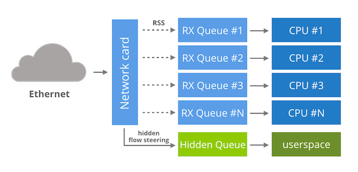
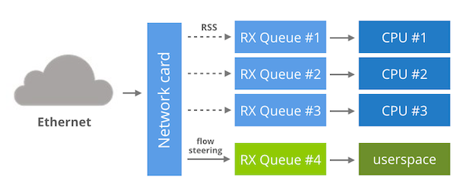
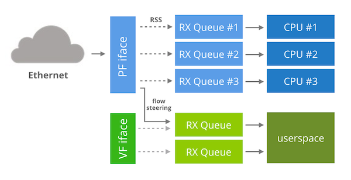

<%inherit file="basecomment.html"/>

<%block filter="filters.markdown">


-------------

I've published an article on the CloudFlare blog:

 * [https://blog.cloudflare.com/kernel-bypass/](https://blog.cloudflare.com/kernel-bypass/)


-------------


<%
a = """


In two previous posts we've discussed [how to receive 1M UDP packets per second](https://blog.cloudflare.com/how-to-receive-a-million-packets/) and [how to reduce the round trip time](https://blog.cloudflare.com/how-to-achieve-low-latency/). We did the experiments on Linux and the performance was very good considering it's a generic purpose operating system.

Unfortunately the speed of vanilla Linux kernel networking is not sufficient for more specialized applications. For example, here at CloudFlare, we are constantly dealing with large packet floods. Vanilla Linux can do only about 1M pps. This is not enough in our environment, especially since the network cards are capable of handling much bigger throughput. Modern 10Gbps NIC's usually can process at least 10M pps.

<div class="image"><div>
<small>CC BY 2.0 <a href="https://www.flickr.com/photos/diversey/4573842992/">image</a> by Tony Webster</small>
</div></div>

It is apparent that the only way to squeeze more packets from our hardware is by working around the Linux kernel networking stack. This is called a "kernel bypass" and in this article we'll dig into various ways of achieving it.


The kernel is insufficient
-----------

Let's prepare a small experiment to convince you that working around Linux is indeed necessary.  Let's see how many packets can be handled by the kernel in perfect conditions. Passing packets to userspace is costly, so instead let's try to drop them as soon as they leave the network driver code. To my knowledge the fastest way to drop packets in Linux, without hacking the kernel sources, is by placing a DROP rule in the `PREROUTING` iptables chain:

```.bash
$ sudo iptables -t raw -I PREROUTING -p udp --dport 4321 --dst 192.168.254.1 -j DROP
$ sudo ethtool -X eth2 weight 1
$ watch 'ethtool -S eth2|grep rx'
     rx_packets:       12.2m/s
     rx-0.rx_packets:   1.4m/s
     rx-1.rx_packets:   0/s
     ...
```

Ethtool statistics above show that the network card receives a line rate of 12M packets per second. By manipulating an indirection table on a NIC with `ethtool -X`, we direct all the packets to RX queue #0. As we can see the kernel is able to process 1.4M pps on that queue with a single CPU.

Processing 1.4M pps on a single core is certainly is a very good result, but unfortunately it doesn't scale. When the packets hit many cores the numbers drop sharply. Let's see the numbers when we direct packets to four RX queues:

```.bash
$ sudo ethtool -X eth2 weight 1 1 1 1
$ watch 'ethtool -S eth2|grep rx'
     rx_packets:     12.1m/s
     rx-0.rx_packets: 477.8k/s
     rx-1.rx_packets: 447.5k/s
     rx-2.rx_packets: 482.6k/s
     rx-3.rx_packets: 455.9k/s
```

Now we process only 480k pps per core. This is a bad news. Even optimistically assuming the performance won't drop further when adding more cores, we would still need more than 20 CPU's to handle a line rate of packets. This is not going to work.


Kernel bypass to the rescue
----------------


<div class="image"><div>
<small>CC BY 2.0 <a href="https://www.flickr.com/photos/londonmatt/11421393074/">image</a> by Matt Brown</small>
</div></div>

The performance limitations of the Linux kernel network [are nothing new](https://lwn.net/Articles/629155/).  Over the years there had been _many_ attempts to address them. The most common techniques involve creating specialized API's to aid with receiving packets from the hardware with high speed. Unfortunately these techniques are in a total flux and a single widely adopted approach hasn't emerged yet.

Here is a list of the most known kernel bypass techniques.

${ "####" } PACKET_MMAP

[Packet_mmap](https://www.kernel.org/doc/Documentation/networking/packet_mmap.txt) is a Linux API for fast packet sniffing. While it's not strictly a kernel bypass technique, it requires a special place on the list - it's already available in vanilla kernels.

${ "####" } PF_RING

[`PF_RING`](http://www.ntop.org/products/packet-capture/pf_ring/) is another know technique that intends to speed up packet capture. Unlike `packet_mmap`, `PF_RING` is not in mainline kernel and it requires special modules. With [ZC drivers](https://github.com/xtao/PF_RING/tree/master/drivers/ZC/intel) and [`transparent_mode=2`](http://www.ntop.org/pf_ring/pf_ring-and-transparent-mode/) the packets will only be delivered the PF_RING client, and not the kernel network stack. Since kernel is the slow part this ensures the fastest operation.

${ "####" } Snabbswitch

[`Snabbswitch`](https://github.com/SnabbCo/snabbswitch/) is a networking framework in Lua mostly geared towards writing L2 applications. It works by completely taking over a network card, and implements a hardware driver in userspace. It's done on a PCI device level with a [userspace IO (UIO)](https://lwn.net/Articles/232575/).  This allows a very fast operation, but it means the packets are completely skipping the kernel network stack.

${ "####" } DPDK

[`DPDK`](dpdk.org/doc) is a networking framework in written in C, created especially for Intel chips. It's similar to `snabbswitch` in spirit, since it's a full framework and [relies on UIO](http://www.slideshare.net/garyachy/dpdk-44585840).

${ "####" } Netmap

[`Netmap`](http://info.iet.unipi.it/~luigi/netmap/) is also a rich framework, but as opposed to UIO techniques it is implemented as a couple of kernel modules. To integrate with networking hardware it requires users to patch the kernel network drivers. The main benefit of the added complexity is a nicely documented, [vendor-agnostic and clean API](https://www.freebsd.org/cgi/man.cgi?query=netmap&sektion=4).


Since the goal of kernel bypass is to spare the kernel from processing packets, we can rule out `packet_mmap`. It doesn't take over the packets - it's just a fast interface for packet sniffing. Similarly, `PF_RING` is unattractive since its main goal is to speed up libpcap.

We've already ruled out two techniques, but unfortunately in our datacenters none of [the remaining solutions](http://www.slideshare.net/shemminger/uio-final) is acceptable either!

Let me show why. In order to achieve kernel bypass all of the remaining techniques: `Snabbswitch`, `DPDK` and `netmap` take over the whole network card, not allowing _any_ traffic on that NIC to reach the kernel. At CloudFlare, we simply can't afford to dedicate the whole NIC to a single offloaded application.

Having said that, many people use the techniques above. I guess in other circumstances dedicating a NIC to bypass could be acceptable.


Solarflare's EF_VI
-----

While the techniques listed above require taking over a whole NIC, there are alternatives.



Solarflare network cards support [OpenOnload](http://www.openonload.org), the magical network accelerator. It achieves a kernel bypass by implementing the network stack in userspace and using an `LD_PRELOAD` to overwrite network syscalls of the target program. For low level access to the network card OpenOnload is relying on an "EF\_VI" library. This library can be used directly and [is well documented](https://support.solarflare.com/index.php?option=com_cognidox&file=SF-114063-CD-1_ef_vi_User_Guide.pdf&task=download&format=raw&Itemid=11).

EF\_VI, being a proprietary library, can be used only on Solarflare NIC's, but you may wonder how it actually works behind the scenes. It turns out EF_VI reuses the usual NIC features in a very smart way.

Under the hood each EF\_VI program is granted access to a dedicated RX queue, hidden from the kernel. By default the queue receives no packets, until you create an EF\_VI "filter". This filter is nothing more than a hidden flow steering rule. You won't see it in `ethtool -n`, but the rule does in fact exist on the network card. Having allocated an RX queue and managed flow steering rules, the only remaining task for EF\_VI is to provide a userspace API for accessing the queue.


Bifurcated driver
--------------



While EF_VI is specific to Solarflare, it's possible to replicate its techniques with other NIC's. To start off we need a multi-queue network card that supports flow steering and indirection table manipulation.

Having these features we can:

 * Start the network card as usual, everything managed by the kernel.
 * By modifying an indirection table we can ensure no packets will flow to one of the RX queues. Let's say to an RX queue #16.
 * We can direct a specific network flow to our RX queue #16 with a flow steering rule.

Having done that, the only remaining step is to provide an userspace API to receive packets from RX queue #16, without affecting any other RX queues.

This idea was being referred to as a "bifurcated driver" in the DPDK community. There was an attempt to [create a bifurcated driver in 2014](http://events.linuxfoundation.org/sites/events/files/slides/LinuxConEurope_DPDK-2014.pdf). Unfortunately [the patch didn't make it](https://patchwork.ozlabs.org/patch/396713/) to the mainline kernel yet.

Virtualization approach
--------------------



There is an alternative strategy for the Intel 82599 chips. Instead of having a bifurcated driver we could use virtualization features of the NIC to do a kernel bypass.

First, I owe a bit of context. It turns out that in the virtualization world passing packets from the host to the guest virtual machine is pretty slow. As the demands for virtualization performance grew over the the years, the usual technique of software emulating the networking hardware became a major hog.

Network card vendors came to the rescue and cooked features to speed up the virtualized guests. In one of the virtualization techniques the network card is asked to present itself as many PCI devices. Those fake virtual interfaces can then be used inside the virtualized guests not requiring any cooperation from the host operating system. Let me show how it looks in practice. For example, this is my native 82599 network card. This "real" device is referred to as a PF (physical function) interface:

```.bash
$ lspci
04:00.1 Ethernet controller: Intel Corporation 82599EB 10-Gigabit SFI/SFP+ Network Connection (rev 01)

```

We ask the device to create one VF (virtual function) device:

```.bash
$ echo 1 > /sys/class/net/eth3/device/sriov_numvfs
$ lspci
04:00.1 Ethernet controller: Intel Corporation 82599EB 10-Gigabit SFI/SFP+ Network Connection (rev 01)
04:10.1 Ethernet controller: Intel Corporation 82599 Ethernet Controller Virtual Function (rev 01)
```

For example, this fake PCI device can be easily given to a KVM guest. On the other hand, nothing stops us from using it the host environment. To do that just load the "ixgbevf" kernel module and another "ethX" interface will pop up.

You may wonder how does it help with the kernel bypass. Well, since the "ixgevf" device is not used by the kernel to do normal networking, we could dedicate it to the bypass. For example, it seems possible [to run DPDK on "ixgbevf" devices](http://dpdk.readthedocs.org/en/latest/nics/intel_vf.html).

To recap: the idea is to keep the PF device to handle normal kernel work and run a VF interface dedicated to the kernel bypass. Since the VF is dedicated we can run the "take over the whole NIC" techniques.

While it sounds good on the paper, it's not all that simple. First, only DPDK supports "ixgbevf" interfaces, netmap and PF_RING don't. Secondly, by default the VF interface won't receive any packets. To send some flows from PF to VF you need [this obscure patch to ixgbe](https://patchwork.ozlabs.org/patch/470164/). With it you can address VF by encoding it in the "action" queue number in `ethtool`, for example:

```.bash
$ ethtool -N eth3 flow-type tcp4 dst-ip 192.168.254.30 dst-port 80 action 4294967296
```

Finally, a last roadblock occurs. By enabling a VF interface on 82599 chip, the maximum size of an RSS group is reduced. Without virtualization 82599 can do RSS over 16 CPU cores. With VF enabled this number falls down to just 4. If you have low traffic on a PF, then spreading it across only 4 cores may be okay. Unfortunately at CloudFlare we need large RSS group sizes.


Final words
-------

Achieving a kernel bypass is not that simple. While many open source techniques exist, all of them seem to require a dedicated network card. We've shown three possible alternative architectures:

 * EF\_VI-style hidden RX queues
 * DPDK bifurcated driver
 * the VF hack

Unfortunately out of the many techniques we've researched only the EF\_VI seem to be a practical in our circumstances. I do hope an open source kernel bypass API will emerge soon, one that doesn't require a dedicated NIC.


"""
%>


</%block>
