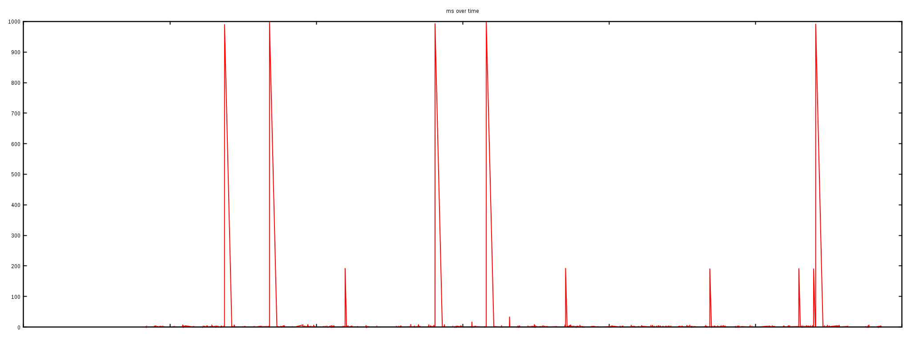
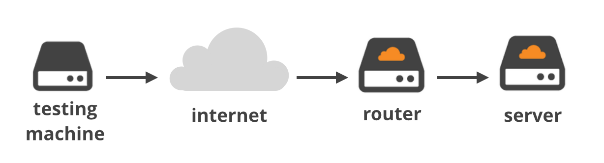
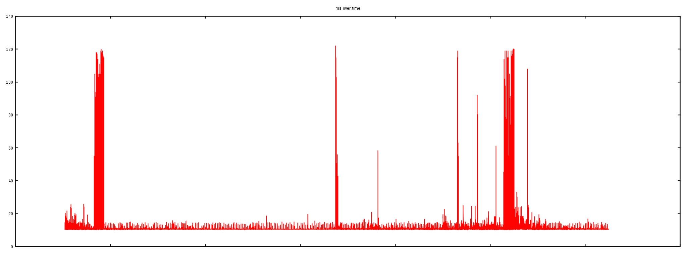
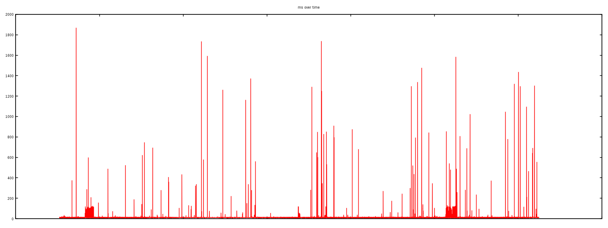
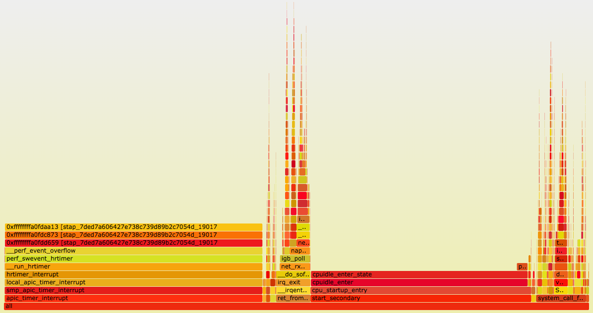

<%inherit file="basecomment.html"/>

<%block filter="filters.markdown">

-------------

I've published an article on the CloudFlare blog:

 * [https://blog.cloudflare.com/the-story-of-one-latency-spike/](https://blog.cloudflare.com/the-story-of-one-latency-spike/)

-------------

<%
a = """


A customer reported an unusual problem with our CloudFlare CDN - allegedly our servers were responding to some HTTP requests slowly. Extremely slowly. 30 seconds slowly. This happened very rarely and wasn't easily reproducible. To make things worse all our usual precautions haven't caught the problem. On application layer everything was in check: Nginx HTTP server didn't log any long running requests.

Time to call for Mr Wolf.

<div class="image"></div>


<small>Source: Pulp Fiction</small>


Following the evidence
------------

First, we attempted to reproduce what the customer reported - long HTTP responses. Here is the chart of HTTP requests time measured against our CDN:

<div class="image"></div>


We run thousands HTTP queries against one server over a couple of hours. The great majority of the requests finished in milliseconds, but you can clearly see that 5 requests took as long as 1000 ms to finish. This is bad.

Safety notice
----

While we constantly monitor hundreds of parameters on each and every server, sometimes we do miss something out. The most subtle and weirdest bugs are often reported by the customers.  If you notice anything unusual (but reproducible!) please report it on our [well established Support Channels](https://support.cloudflare.com/hc/en-us).


Blame the network
-------------

The spikes in HTTP load times may indicate some kind of network issue. To be sure we run ICMP ping's  against two IP's over many hours.

<div class="image"></div>


The first "ping" went from an external test machine to the router and showed a flat latency of about 20ms (with the exception of two peaks at about 120ms due to the VPS slowness):

```.txt
--- ping statistics ---
114890 packets transmitted, 114845 received, 0% packet loss
rtt min/avg/max/mdev = 10.432/11.025/122.768/4.114 ms
```

<div class="image"></div>


This ~20 ms is a decent round trip time (RTT) for that network and confirms the network connection was in fact stable.


The second "ping" session was launched from our external test machine against one of our Linux CDN servers behind the router:

```.txt
--- ping statistics ---
114931 packets transmitted, 114805 received, 0% packet loss
rtt min/avg/max/mdev = 10.434/11.607/1868.110/22.703 ms
```

<div class="image"></div>


The "ping" output shows the max RTT being 1.8s. The gigantic latency spikes are also clearly visible on the graph.

The first experiment showed that the network between the external testing server and a router is not malfunctioning. But the second test, against a server just behind this router, revealed awful spikes. This indicates the problem is somewhere between the router and the server inside our datacenter.


Tcpdump for the rescue
---------

To verify the problem we've run a `tcpdump` on the affected server, trying to pinpoint the particular ICMP packets affected by a spike:

```.txt
$ tcpdump -ttt -n -i eth2 icmp
00:00.000000 IP x.x.x.a > x.x.x.b: ICMP echo request, id 19283
00:01.296841 IP x.x.x.b > x.x.x.a: ICMP echo reply, id 19283
```

As you see from this `tcpdump` output one particular ICMP packet was indeed received time from the network, but for some reason the operating system waited 1.3 s before answering it. On Linux the network packets are handled promptly on the interrupt. Delaying the ICMP response indicates a serious kernel trouble.


Welcome the System Tap!
----------

To understand what's going on we had to look at the internals of operating system packet processing. Nowadays there is a plethora of debugging tools for Linux and, for no particular reason, we chose System Tap (`stap`). With a help of [a flame graph](http://brendangregg.com/FlameGraphs/cpuflamegraphs.html) we identified a function of interest: `net_rx_action`.

```
$ ./flame-kernel-global.sh
$ ./stackcollapse-stap.pl out.stap-stacks | ./flamegraph.pl > stap-kernel.svg
```

A generated image:

<div class="image"></div>


The `net_rx_action` function is responsible for handling packets in Soft IRQ mode. It will handle up to `netdev_budget` packets in one go:

```
$ sysctl net.core.netdev_budget
net.core.netdev_budget = 300
```

Here is a run of [our `stap` script showing the latency](https://github.com/majek/dump/blob/master/system-tap/histogram-kernel.stp) distribution for this function:

```.sh
$ stap -v histogram-kernel.stp 'kernel.function("net_rx_action)"' 30
Duration min:0ms avg:0ms max:23ms count:3685271
Duration (ms):
value |-------------------------------------------------- count
    0 |@@@@@@@@@@@@@@@@@@@@@@@@@@@@@@@@@@@@@@@@@@@@@  3685011
    1 |                                                   215
    2 |                                                    30
    4 |                                                     9
    8 |                                                     5
   16 |                                                     1
   32 |                                                     0
```

During the 30 s run, we hit the `net_rx_action` function 3.6 million times. Out of these runs most finished under 1ms, but there were some out layers. Most importantly one run took an astonishing 23 ms.


Having a 23ms stall in low level packet handling is disastrous. It's totally possible to run out of buffer space and start dropping packets if a copule of such events get accumulated. No wonder the ICMP packets weren't handled in time!

Deeper into the rabbit hole
----------

We repeated the procedure a couple more times. That is:

 - We made a flame graph [source](https://github.com/majek/dump/blob/master/system-tap/flame-kernel.stp).
 - By trial and error figured out which descendant of
   `net_rx_action` caused the latency spike [source](https://github.com/majek/dump/blob/master/system-tap/histogram-kernel.stp).

This procedure was pretty effective, and after a couple of runs we identified the culprit: the [`tcp_collapse`](http://lxr.free-electrons.com/source/net/ipv4/tcp_input.c?v=4.2#L4602) function. Here's a summary of latency measurements:

```.txt
$ stap -v histogram-kernel.stp 'kernel.function("tcp_collapse")' 300
Duration min:0ms avg:3ms max:21ms count:1552
```

Over 300 seconds there were just about 1500 runs of the `tcp_collapse` function. Out of these runs half finished in under 3ms, but the a max time was 21ms.


Let's collapse the TCP
-------

The `tcp_collapse` function is interesting. It turns out to be deeply intermixed with how BSD sockets API works. To fully understand it let's start with a pub question:

> If you set a "receive buffer size" on a TCP socket, what does it
> actually mean?

Go on, read [the man page](http://man7.org/linux/man-pages/man7/tcp.7.html), dust off your [Stevens](https://books.google.co.uk/books?id=X-l9NX3iemAC). I'll wait.


The naive answer would go something among the line of: the TCP receive buffer setting indicates what is the maximum number of bytes a `read()` syscall could retrieve without blocking.

While this is the intention, this is not exactly how it works. In fact, [the receive buffer size value](http://lxr.free-electrons.com/source/include/net/sock.h?v=4.2#L228) on a socket is a hint to the operating system on how much total memory it could use for the handling of the received data. Most importantly - this includes not only the payload bytes that could be delivered to the application, but also the metadata around it.

Under normal circumstances, a TCP socket structure contains a doubly-linked list of packets - the [`sk_buff` structures](http://people.cs.clemson.edu/~westall/853/notes/skbuff.pdf). Each packet contains not only the the data, but also the `sk_buff` metadata (sk_buff is said [to take 240 bytes](https://lwn.net/Articles/466494/)). The metadata size does count against the receive buffer size counter. In a pessimistic case - when the packets are very short - it is possible the receive buffer memory is almost entirely used by the metadata.

Using a large chunk of receive buffer space for the metadata is not really what the programmer wants. To counter that, when the socket is under a memory pressure a complex logic is run with the intention of freeing some space. One of the operations `tcp_collapse` and it will merge adjacent TCP packets into one larger `sk_buff`.  This behavior is pretty much a garbage collection (GC) - and as everyone knows, when the garbage collection kicks in, the latency must spike.


Tuning the rmem
--------

There are two ways to control the TCP socket receive buffer on Linux:

 * You can set `setsockopt(SO_RCVBUF)` value explicitly.
 * Or you can leave it to the operating system and allow it to
   auto-tune it, using `tcp_rmem` sysctl as a hint.

At CloudFlare we use the latter approach and the receive buffer sizes are controlled by a sysctl:

```
$ sysctl net.ipv4.tcp_rmem
net.ipv4.tcp_rmem = 4096 5242880 33554432
```

This setting tells Linux to autotune socket receive buffers, and allocate between 4KiB and 32MiB, with a default start buffer of 5MiB.


Since the receive buffer sizes are fairly large, the garbage collection could take a long time.  To test this we reduced the max `rmem` size to 2MiB and repeated the latency measures:

```.txt
$ sysctl net.ipv4.tcp_rmem
net.ipv4.tcp_rmem = 4096 1048576 2097152

$ stap -v histogram-kernel.stp 'kernel.function("tcp_collapse")' 300
Duration min:0ms avg:0ms max:3ms count:592
```

Now, this numbers are so much better. With the change settings the `tcp_collapse` never took more than 3ms!


We verified that the `net_rx_action` latency also improved:


```.txt
$ stap -v histogram-kernel.stp 'kernel.function("net_rx_action")'
Duration min:0ms avg:0ms max:3ms count:3567235
Duration (ms):
value |-------------------------------------------------- count
    0 |@@@@@@@@@@@@@@@@@@@@@@@@@@@@@@@@@@@@@@@@@@@@@  3567196
    1 |                                                    36
    2 |                                                     3
    4 |                                                     0
```

With the `rmem` changes the max latency of observed `net_rx_action` times dropped from 23ms to just 3ms.


Summary
-------

Setting the `rmem` sysctl to only 2MiB is not recommended as it could affect the performance of high throughput, high latency connections. On the other hand reducing `rmem` definitely helps to alleviate the observed latency issue. We settled with 4MiB max `rmem` value which offers a compromise of reasonable GC times and shouldn't affect the throughput on TCP layer.


But most importantly, we showed how to use System Tap to debug latency issues. Use our scripts to measure the `net_rx_action` latency on your system!

Our [simple Stap scripts](https://github.com/majek/dump/blob/master/system-tap/)  are available on GitHub.

<div class="image"></div>


Almost always CloudFlare CDN service is very fast, but sometimes we do hit an unexpected bottleneck. We are constantly monitoring our systems and trying to improve it. In some situations that can be achieved by simply adding another datacenter, other times it requires significant System Tap trickery and weeks at staring into the kernel sources. The fixes mentioned in this article have already been rolled out. All our customers should feel just a tiny bit faster :)


These are the kind of issues we deal with all the time here at CloudFlare. Sounds interesting? [We're hiring](https://www.cloudflare.com/join-our-team/) in London, Singapore and San Francisco!


"""
%>


</%block>
