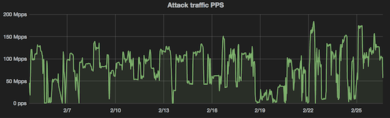
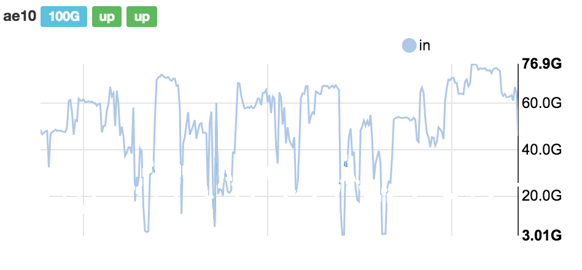
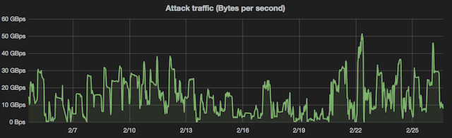

<%inherit file="basecomment.html"/>

<%block filter="filters.markdown">

-------------

I've published an article on the CloudFlare blog:

 * [https://blog.cloudflare.com/a-winter-of-400gbps-weekend-ddos-attacks/](https://blog.cloudflare.com/a-winter-of-400gbps-weekend-ddos-attacks/)

-------------

<%
a = """

CloudFlare is used by a large number of websites. We have all kind of customers from big, reputable companies, through government agencies, to websites dedicated to images of [kittens](https://placekitten.com/).

But here is the thing - we do not discriminate websites based on the content they provide. We have a very strict [content policy](https://blog.cloudflare.com/thoughts-on-abuse/) and do our best to adhere to it.

Some of our customers are constantly being DoS'ed. Having to deal with never stopping attacks is the cost of being content neutral.

While we could discuss who is being attacked, why they are targeted and who are the attackers - this is irrelevant. Anyone can become a target. No matter if the attacker is [a government agency](http://www.bbc.com/news/technology-26049448) or [a gang on the other side of Pacific](http://www.koreatimes.co.kr/www/news/nation/2011/01/113_79384.html), we are here to help.

${"##"} The attack

Fundamentally there are two types of DoS attacks:

 * *L3* - the attack constitutes a large volume of packets hitting the target network. The aim is usually to overwhelm the target network hardware.

 * *L7* - the attack is created of large number of established TCP connections from bots to the target. The goal of the attacker is to overwhelm the target's server. With large number of connections it's usually pretty easy to saturate the target CPU processing power.

It's important to understand that it's the L3 attacks that are making it to the headlines. They cause the largest damage and often the only solution is to acquire network capacity and buy beefy networking hardware. If you hear about [the 300 Gbps attack](https://blog.cloudflare.com/the-ddos-that-almost-broke-the-internet/), or some other record attacks, it's all most likely an L3. It's really hard to generate substantial attack traffic with an L7 attack - the TCP itself has all kind of protections to slow down if the end peer is overloaded.

${"##"} The usual day at CloudFlare

Historically the L3 attacks were the biggest headache for CloudFlare. Over the last two years we've managed to automate most of the attack handling. On a typical day our system reacts between 20 and 80 times. Here is a chart of *DoS events* in the last quarter of 2015:

<gnuplot>
size: 500x350
--
set datafile separator ","

set xtics rotate
set border 3;
set xtics nomirror;
set ytics nomirror;

set timefmt '%Y-%m-%d'

set ylabel "Daily DoS events"

set xdata time
set format x "%b"

set xrange ["2015-10-01": "2015-12-31"]
set key off

plot \
  "y.csv" using 2:1 with lines
</gnuplot>

${"##"} Some days it gets worse

Most of the mitigated *DoS events* are small. When big attacks happen - it usually shows up as a large number of the *events*.

Over last month we're dealing with such an attack. Here is the same "DoS daily events" chart, but including this year. Notice the scale.

<gnuplot>
size: 500x350
--
set datafile separator ","

set xtics rotate
set border 3;
set xtics nomirror;
set ytics nomirror;

set timefmt '%Y-%m-%d'

set ylabel "Daily DoS events"


set xdata time
set format x "%b"

set xrange ["2015-10-01": "2016-03-01"]
set key off

plot \
  "y.csv" using 2:1 with lines
</gnuplot>

The attacks going through late January / February are interesting for a number of reasons.

First, the spikes align with the weekends. I guess the attackers are busy with something else during the week.

Next, they are targeting a couple of fairly benign websites. This only proves the point that anyone can become a target of a large attack.

Lastly, the volume of the attack is unprecedented. Let me elaborate on this point.

When operating at a smaller scale, it's not unusual for an attack to overwhelm the network capacity of the target. This causes network congestion and forces the attacked network to [black hole](https://en.wikipedia.org/wiki/Black_hole_(networking)) the attacked IP addresses, pretty much removing them from the internet.

The recent attacks we encountered were large, but we didn't have to resort to black holing too often. This is great, we were able to (mostly) keep our services available.


We measure the attack volume in two dimensions - number of packets per second (pps) being sent and the attack bandwidth in bits per second (bps).

${ "##"} The volume in packets


*Packets per second* metric is important, since the processing power required on a router raises proportionally with pps count. Whenever an attack overwhelms our router we will see a frantic error messages like this:

```
PROBLEM/CRITICAL edge21.sin01.cloudflare.cc router PFE hardware drops
CRITICAL: Info cell drops are increasing at a rate of 210106.35/s.
CRITICAL: Fabric drops are increasing at a rate of 329678.81/s.
```


The good news is that in the recent attacks our hardware was holding strong. Kudos to our networking team for keeping the networking hardware up to the task.

It's not uncommon for attacks against us to reach 100M pps. Recently attacks were larger and peaked at 180M pps. This is way larger than our normal inbound traffic levels. It's fair to say that CloudFlare receives much more attack packets than legitimate packets. Here is a chart of attack packet per second we received lately.



In last couple of  weeks we had  attacks hitting us constantly, without a stop.


${ "##"} The volume in bits

The other interesting parameter is size of the attack in gigabits per second. Some large attacks saturate the network capacity, rather than router processing power. If that happens we will see alerts like this:

```
PROBLEM/CRITICAL edge112.tel01.cloudflare.cc router interfaces
CRITICAL: ae-1/2/2 (HardLayer) in: 81092mbps (81.10%)
```

In this case a 100Gbps link got dangerously full. In fact in recent weeks a couple of our fat links got quite busy on inbound, hitting a ceiling at 77Gbps:



We speculate the congestion occurred on the other side of the network - close to the attackers. We're investigating this with our internet provider.

The recent attacks peaked at around 400Gbps of aggregate inbound traffic. The peak wasn't an one-off spike, it lasted for a couple of hours:




${ "##" } Final words

Over the past weeks we encountered a number of large attacks. Our systems reported over 400Gbps of incoming traffic which is among st the largest by aggregate volume we've seen. The attack was mostly absorbed by our automatic mitigation systems.

But it was not all roses. Some part of the traffic slipped past the defenses and caused increased load on a couple of servers.

With each attack we are learning. We're constantly working on improving our mitigation systems and identifying bottlenecks in the network.

One could think that as CloudFlare grows, the relative scale of attacks will shrink in comparison to our legitimate traffic. The funny thing is that the opposite is true. Every time we upgrade our network capacity we see larger attacks. The attackers seem to also have access to ever increasing network capacity.

""" %>
</%block>
