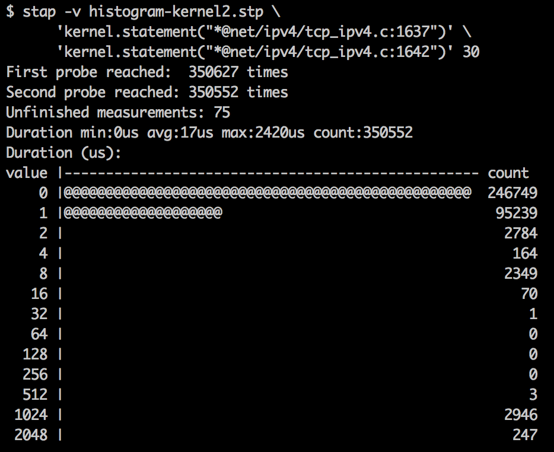

<%inherit file="basecomment.html"/>

<%block filter="filters.markdown">

-------------

I've published an article on the CloudFlare blog:

 * [https://blog.cloudflare.com/revenge-listening-sockets/](https://blog.cloudflare.com/revenge-listening-sockets/)

-------------


<% a = """
Back in November we wrote
[a blog post about one latency spike](https://blog.cloudflare.com/the-story-of-one-latency-spike/). Today I'd like to share a continuation of this story. As it turns out, the misconfigured `rmem` setting wasn't the only source of our latency problems.

Seems that Mr Wolf haven't finished his job.

<div><iframe width="640" height="360" src="https://www.youtube.com/embed/YgxACD-rL5c" frameborder="0"></iframe></div>

After adjusting the previously discussed `rmem` sysctl we continued monitoring our systems latency. Among other things we measured `ping` times to our edge servers. The worst case improved, we didn't see 1000ms times anymore, but the line still wasn't flat. Here's the graph of ping latency between an idling jumpbox machine and a production server. The test has been done within the datacenter, the packets never went to public internet. The chart shows `ping` times in millisecond, taken each second over a 6 hours time window:

<div class="image"></div>

As you can see most pings finished in below 1ms. But out of 21600 measurements about 20 had high latency hitting up to 100ms. This is bad.

${"##"} System tap

The latency occurs within our datacenter and the packets aren't lost. This suggests a kernel issue again. Linux responds to ICMP pings from its soft interrupt handling code. Using the [system tap script](https://github.com/cloudflare/cloudflare-blog/blob/master/2016-04-bind-to-star/histogram-kernel.stp) we can see the time distribution of main soft IRQ function `net_rx_action`:

<div class="image"></div>

<% a='''\
```
$ stap -v histogram-kernel.stp 'kernel.function("net_rx_action")'
Duration min:0us avg:81us max:49202us count:1907793
Duration (us):
 value |-------------------------------------------------- count
     0 |@@@@@@@@@@@@@@@@@                                  165951
     1 |@@@@@@@@@@@@@@@@@@@@@@@@@@@@@@@@@@@@@@@@@@@@@@@@@  479620
     2 |@@@@@@@@@@@@@@@@@@@@@@@@@@@@                       274963
     4 |@@@@@@@@@@@@@@@@@@@@@@@@                           236150
     8 |@@@@@@@@@@@@@@@@@@@@@@@@@@@@@@@@@@@@@@             373378
    16 |@@@@@@@@@@@@@@@@@@@@@@@@                           231869
    32 |@@@@@                                               50354
    64 |@                                                   11343
   128 |                                                     3942
   256 |                                                     1074
   512 |@@                                                  23151
  1024 |@@@@                                                41204
  2048 |                                                     9192
  4096 |                                                     3797
  8192 |                                                     1555
 16384 |                                                      247
 32768 |                                                        3
```
''' %>

This is pretty awful. While most of the calls to the `net_rx_action` were handled under 81 us (average), the long outliers are really bad. Handling three batches of packets during the 30 second test took a whopping 32ms! No wonder the ping times were off.

${"##"} The inet_lookup is slow

With some back and forth with flame graphs and the [`histogram-kernel.stp`](https://github.com/cloudflare/cloudflare-blog/blob/master/2016-04-bind-to-star/histogram-kernel.stp) script we dug deeper to find the problem. We found that the [`tcp_v4_rcv`](http://lxr.free-electrons.com/source/net/ipv4/tcp_ipv4.c?v=3.18#L1585) exposed similarly poor latency distribution. More specifically the problem lies between lines 1637 and 1642 of the `tcp_ipv4.c` file. We wrote [another script to show](https://github.com/cloudflare/cloudflare-blog/blob/master/2016-04-bind-to-star/histogram-kernel2.stp) that:

<div class="image"></div>

<% a= '''
```
$ sudo stap -v histogram-kernel2.stp 'kernel.statement("*@net/ipv4/tcp_ipv4.c:1637")' 'kernel.statement("*@net/ipv4/tcp_ipv4.c:1642")' 30
First probe reached:  350627 times
Second probe reached: 350552 times
Unfinished measurements: 75
Duration min:0us avg:17us max:2420us count:350552
Duration (us):
value |-------------------------------------------------- count
    0 |@@@@@@@@@@@@@@@@@@@@@@@@@@@@@@@@@@@@@@@@@@@@@@@@@  246749
    1 |@@@@@@@@@@@@@@@@@@@                                 95239
    2 |                                                     2784
    4 |                                                      164
    8 |                                                     2349
   16 |                                                       70
   32 |                                                        1
   64 |                                                        0
  128 |                                                        0
  256 |                                                        0
  512 |                                                        3
 1024 |                                                     2946
 2048 |                                                      247
```
''' %>

The culprit is this specific line in `tcp_v4_rcv` function:

```.c
sk = __inet_lookup_skb(&tcp_hashinfo, skb, th->source, th->dest);
```

The numbers shown above indicate that the function usually terminates quickly, in under 2us, but sometimes it hits a slow path and takes 1-2ms to finish.

The [`__inet_lookup_skb`](http://lxr.free-electrons.com/source/include/net/inet_hashtables.h?v=3.18#L343) is inlined which makes it tricky to accurately measure. Fortunately the function is simple - all it does is to call `__inet_lookup_established` and `__inet_lookup_listener`. It's the latter function that is causing the trouble:

<div class="image"></div>
<% a = '''
```
$ sudo stap -v histogram-kernel.stp 'kernel.function("__inet_lookup_listener")' 30
Duration min:0us avg:881us max:2359us count:6779
Duration (us):
value |-------------------------------------------------- count
    0 |@@@@@@@@@@@@@@@@@@@@@@@@@@@                        1639
    1 |@@@@@@@@@@@@@@@@@@@@@@@@@@@@                       1702
    2 |@@@                                                 220
    4 |                                                      7
    8 |                                                     11
   16 |                                                      1
   32 |                                                      0
   64 |                                                      0
  128 |                                                      0
  256 |                                                      0
  512 |                                                      1
 1024 |@@@@@@@@@@@@@@@@@@@@@@@@@@@@@@@@@@@@@@@@@@@@@@@@@  2928
 2048 |@@@@                                                270
```
''' %>

Let's discuss how `__inet_lookup` works. This function tries to find appropriate `sock struct` for the connection. This is done in `__inet_lookup_established` call. If that fails, the `__inet_lookup` will attempt to find a bound socket in listening state that could potentially handle the packet. For example, if the packet is SYN and the listening socket exists we could to respond with SYN+ACK. If there is no bound socket we should send an RST. The `__inet_lookup_listener` function finds the bound socket. It does so by using the destination port of the packet as a hash and picks up appropriate bucket in `LHTABLE` hash table. With the bucket handy it iterates over it linearly to find the specific matching listening socket.

To understand the problem we traced the slow packets. To do that [we run a specially crafted system tap script](https://github.com/cloudflare/cloudflare-blog/blob/master/2016-04-bind-to-star/duration-inet-lookup2.stp). It hooks onto `__inet_lookup_listener` and prints out the details of slow packets:

<div class="image"></div>

<% a='''
```
$ stap -P -v duration-inet-lookup-listener.stp
2ms __inet_lookup_listener 64.87.182.129:8080->32.144.65.95:16725
2ms __inet_lookup_listener 64.87.182.129:8080->32.144.65.95:16725
2ms __inet_lookup_listener 64.87.182.129:8080->32.144.65.95:16725
2ms __inet_lookup_listener 64.87.182.129:8080->32.144.65.95:16725
2ms __inet_lookup_listener 19.41.121.4:28298 -> 122.119.0.89:53
2ms __inet_lookup_listener 19.41.121.4:28298 -> 122.119.0.89:53
2ms __inet_lookup_listener 19.41.121.4:28298 -> 122.119.0.89:53
2ms __inet_lookup_listener 15.59.76.213:80 -> 198.40.202.145:63925
2ms __inet_lookup_listener 15.59.76.213:80 -> 198.40.202.145:63925
2ms __inet_lookup_listener 15.59.76.213:80 -> 198.40.202.145:63925
2ms __inet_lookup_listener 15.59.76.213:80 -> 198.40.202.145:63925
2ms __inet_lookup_listener 15.59.76.213:80 -> 198.40.202.145:63925
```
''' %>

With this data we went deeper and matched these log lines to specific packets by using `tcpdump`.  I'll spare you the details, but these are inbound SYN and RST packets which destination port modulo 32 is equal to 21. Check it out:

 - 16725 % 32 = 21
 - 53 % 32 = 21
 - 63925 % 32 = 21

Now, where do this magic numbers come from?

${"##"} The listening hash table

Linux maintains a listening hash table that contains all the listening TCP sockets. This table is referenced as `INET_LHTABLE` and it has a fixed sized of [32 buckets](http://lxr.free-electrons.com/source/include/net/inet_hashtables.h?v=3.18#L117):

```.txt
/* Yes, really, this is all you need. */
#define INET_LHTABLE_SIZE       32
```

To recap:

 - LHTABLE is small - it has only 32 buckets
 - LHTABLE is hashed by destination port only

It's a good time for a quick diversion, let's speak about CloudFlare's DNS server.

${"##"} Let's speak about DDoS

At CloudFlare we are using a custom DNS server internally called `RRDNS`. Among many other requirements, the server is designed to withstand DDoS attacks.

Even though our server is pretty fast when a really large attack kicks in it might unable to cope with the attack load. If that happens we must to contain the damage - even if one IP address is under a heavy attack the server must still cope with legitimate traffic on other IP addresses. In fact, our DNS architecture is designed to spread the load among 16 thousands IP addresses.

When an IP address is under attack, and the server is not keeping up with incoming packets, the kernel receive queue on UDP socket will overflow. We monitor that by looking at the `netstat` counters:

    $ netstat -s --udp
    Udp:
        43957575 packet receive errors

With that number increasing we can list the affected IP addresses by inspecting the UDP sockets with non-empty receive queues:

```
$ netstat -ep4ln --udp|grep 53 |egrep -v "^udp *0"
udp   524293    0 173.245.1.1:53    0.0.0.0:*      0
udp   524288    0 173.245.2.3:53    0.0.0.0:*      0
```

In this case two IP addresses received heavy UDP traffic. It was more than the DNS server could handle, and the queues overflowed. Fortunately, because we are binding to specific IP addresses, overflowing two UDP receive queues won't affect other IP addresses.

Binding to specific IP addresses is critical to keep our DNS infrastructure online. Even if other mitigation techniques fail and the DNS server is left exposed to the packet flood, we are certain the attack will not break DNS on other IP addresses.

But what it has to do with the LHTABLE? Well, in our setup we bound to specific IP addresses for both UDP and TCP as well. While having 16 thousand of listening sockets in UDP is okay, it turns out it is not fine for TCP.

${"##"} What happened

Due to our DNS setup we had 16 thousand TCP sockets bound to different IP addresses on port 53. Since the port number is fixed, all these sockets ended in exactly one LHTABLE bucket. This particular bucket was number 21 (53%32=21). When any RST or SYN packet went to `port % 32 == 21`, then `__inet_lookup_listener` had to traverse 16k socket entries. This wasn't fast, in fact it took 2ms to do so.

To solve the problem we deployed two changes:

 - For TCP connections our DNS server now binds to ANY IP address (aka 0.0.0.0:53, *:53). We call that "bind to star". While binding to specific IP addresses is still necessary for UDP, there is little benefit in doing that for TCP traffic. We can bind to star for TCP safely.

 - We increased the LHTABLE size in our kernels. We are not the first to do that.: Bill Sommerfeld from Google [suggested that back in 2011](http://patchwork.ozlabs.org/patch/79014/).


With these changes deployed the `ping` times are finally flat, as they should always have been:

<div class="image"></div>


${"##"} Final words

In this blog post we described how we learned the hard way that you can't have too many bound TCP sockets. We learned a bit about Linux networking stack: the fact that LHTABLE is fixed size and is hashed by destination port only. Once again we showed a couple of [powerful of System Tap scripts](https://github.com/cloudflare/cloudflare-blog/blob/master/2016-04-bind-to-star).

With the fixes we deployed our users should expect to see the max latency numbers to drop significantly. Now we are confident the soft interrupt handling in `net_rx_action` is in behaving well. With one layer fixed, we are continuing to look for other sources of increased latency.

If this sounds interesting, [consider joining us](https://www.cloudflare.com/join-our-team/).

""" %>

</%block>
