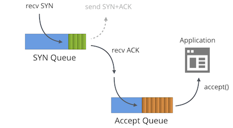
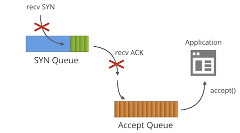
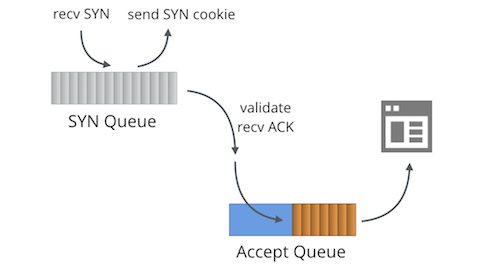

<%inherit file="basecomment.html"/>
<%block filter="filters.markdown">


<div class="image" style="height:364px"></div>

I've published an article on the Cloudflare blog describing SYN Cookies, SYN floods, SYN Queue and Accept Queue:

 * [https://blog.cloudflare.com/syn-packet-handling-in-the-wild/](https://blog.cloudflare.com/syn-packet-handling-in-the-wild/)


<%doc>

Under a constant flood - Operating a TCP server in the wild
===

At Cloudflare we are mastering the dark art of operating critical
services on the wild Internet. In this very blog we touched on
multiple dark corners of the Internet protocols: like
[FIN-WAIT-2](https://blog.cloudflare.com/this-is-strictly-a-violation-of-the-tcp-specification/)
or
[receive buffer tuning](https://blog.cloudflare.com/the-story-of-one-latency-spike/). One
subject though didn't get enough attention - SYN floods. We are using
Linux and it turns out understanding Linux SYN packet flow is
genuinely hard. In this post we'll shine some light on the subject.


The tale of two queues
----------------------
<div class="image" style="height:364px"></div>

First we must understand that each bound socket, in LISTENING TCP
state on Linux has two separate queues:

 * The SYN Queue
 * The Accept Queue

In literature these queues are often named "reqsk_queue", "ACK
backlog" and "listen backlog" but I find these names confusing.

SYN Queue
---------

SYN Queue stores inbound SYN packets[^1] (specifically: [`struct request_sock`](https://elixir.free-electrons.com/linux/v4.14.12/source/include/net/request_sock.h#L48)). It's
responsible for sending out SYN+ACK packets and retrying them on
timeout. On Linux the number of retries is configured with:

```
$ sysctl net.ipv4.tcp_synack_retries
net.ipv4.tcp_synack_retries = 5
```

The [docs describe this toggle well](https://www.kernel.org/doc/Documentation/networking/ip-sysctl.txt):

```
tcp_synack_retries - INTEGER

	Number of times SYNACKs for a passive TCP connection attempt
	will be retransmitted.Should not be higher than 255. Default
	value is 5, which corresponds to 31seconds till the last
	retransmission with the current initial RTO of 1second. With
	this the final timeout for a passive TCP connection will
	happen after 63seconds.

```

After transmitting the SYN+ACK, SYN Queue waits for an ACK packet from the client: the last stage of the three-way-handshake. All received ACK packets must first matched against fully established connections, and only then against data in relevant SYN Queue. On SYN Queue match, kernel removes the item from SYN Queue, happily creates a fully fledged connection (specifically: [`struct sock`](https://elixir.free-electrons.com/linux/v4.14.12/source/include/net/sock.h#L234)), and adds it to the Accept Queue.

The maximum allowed length of SYN Queue is taken from the `backlog` parameter passed to `listen(2)` syscall. For example this sets the SYN Queue size to 1024:

```
listen(sfd, 1024)
```

Note: In kernels before 4.3 the [SYN Queue length was counted differently](https://github.com/torvalds/linux/commit/ef547f2ac16bd9d77a780a0e7c70857e69e8f23f#diff-56ecfd3cd70d57cde321f395f0d8d743L43).

This SYN Queue cap used to be limited by `net.ipv4.tcp_max_syn_backlog` toggle, but isn't the case anymore. Nowadays `net.core.somaxconn` caps both the SYN Queue as well as the Accept Queue sizes. On our servers we bumped it to 16k:

```
$ sysctl net.core.somaxconn
net.core.somaxconn = 16384
```

Accept Queue
------------

Accept Queue contains fully established connections: ready to be picked up by the application. When a process calls `accept()`, the sockets are de-queued and passed to the application.

This is a rather simplified view on the SYN packet data flow. With socket toggles like `TCP_DEFER_ACCEPT`[^2] and `TCP_FASTOPEN` things work slightly differently.

Knowing all that, we might ask the question - what is the appropriate `backlog` parameter value?

It depends. For the majority of trivial TCP Servers it doesn't really matter. For example [Golang famously doesn't support customizing backlog value](https://github.com/golang/go/issues/6079) and hardcodes it at 128. There are valid reasons to bump this value though:

 - When the count of incoming connections is really large, even with performant application, the inbound SYN Queue may need a larger number of slots to hold them.
 - `Backlog` value controls the SYN Queue size. This effectively can be read as "ACK packets in flight". The larger average RTT to client - the more slots are going to be used. In case of many clients far away from the server, hundreds of milliseconds away, it makes sense to increase queue size.
 - `TCP_DEFER_ACCEPT` option causes sockets to remain in SYN-RECV state longer and contribute against the precious queue limits.

To peek into the SYN Queue on Linux we can use `ss` and look for `SYN-RECV` sockets. For example, on one of Cloudflare servers we can see roughly 119 slots used in tcp/80 SYN Queue and 78 on tcp/443.

```
$ ss -n state syn-recv sport = :80 | wc -l
119
$ ss -n state syn-recv sport = :443 | wc -l
78
```

Similar data can be shown with our [overenginered SystemTap script: `resq.stp`](XXX).

Slow application
----------------

<div class="image" style="height:364px"></div>

What happens if the application can't keep and doesn't call `accept()` fast enough?

In normal case, magic will happen. When the Accept Queue gets full (is of a size of `backlog`+1) then:

 * Inbound SYN packets to SYN Queue will get dropped.
 * Inbound ACK packets to SYN Queue will get dropped.
 * TcpExtListenOverflows / `LINUX_MIB_LISTENOVERFLOWS` counter is incremented.
 * TcpExtListenDrops / `LINUX_MIB_LISTENDROPS` counter is incremented.

There is a strong rationale for dropping *inbound* packets in this case: this is a push-back mechanism. The other party will sooner or later resend the SYN or ACK packets, by which point, the hope is, our slow application will recover.

This is a desirable behavior in most scenarios. For completeness: it can be adjusted by the global `net.ipv4.tcp_abort_on_overflow` toggle, but don't touch it.

If your server needs to handle large number of inbound connections and is struggling with `accept()` throughput consider reading our [Nginx tuning / Epoll work distribution](https://blog.cloudflare.com/the-sad-state-of-linux-socket-balancing/) post and a [follow up showing useful SystemTap scripts](https://blog.cloudflare.com/perfect-locality-and-three-epic-systemtap-scripts/).

You can trace the Accept Queue overflow case with `nstat` counter:

```
$ nstat -az TcpExtListenDrops
TcpExtListenDrops     49199     0.0
```

Unfortunately this is a global counter. Sometimes it's possible to see it increasing, while all applications seem healthy! First step is always to just print the Accept Queue sizes with `ss`:
```
$ ss -plnt sport = :6443|cat
State   Recv-Q Send-Q  Local Address:Port  Peer Address:Port
LISTEN  0      1024                *:6443             *:*
```

The column `Recv-Q` shows number of sockets in Accept Queue, and `Send-Q` shows the backlog parameter. In this case we see there are no outstanding sockets to be `accept()`ed, but we still saw the ListenDrops counters increasing.

It turns out our application was very spiky and would get stuck for a fraction of a second. This was sufficient to let the Accept Queue to overfill for a very brief period of time. Moments later would recover. Cases like this are hard to debug with `ss`, so we wrote [an `acceptq.stp` SystemTap script](XXX) to help us. It hooks into kernel and prints the SYN packets which are actually dropped:

```
$ sudo stap -v acceptq.stp
time (us)        acceptq qmax  local addr    remote_addr
1495634198449075  1025   1024  0.0.0.0:6443  10.0.1.92:28585
1495634198449253  1025   1024  0.0.0.0:6443  10.0.1.92:50500
1495634198450062  1025   1024  0.0.0.0:6443  10.0.1.92:65434
...
```

Here you can see precisely what SYN packets were affected by the application. With this script it's trivial to understand which application is dropping connections.


SYN Flood
---------

<div class="image" style="height:364px"></div>

If it's possible to overflow the Accept Queue, it must be possible to
overflow the SYN Queue as well. What happens then?

This is precisely what [SYN Flood attacks](https://en.wikipedia.org/wiki/SYN_flood) do. In past flooding the SYN Queue with bogus spoofed SYN packets had been a real problem. Before 1996 it was possible to successfully deny the service to almost any TCP server on the internet with very little bandwidth, just by filling the SYN Queues.

The solution are [SYN Cookies](https://lwn.net/Articles/277146/). SYN Cookies are a construct that allows the SYN+ACK to be generated statelessly, without actually saving the inbound SYN and wasting system memory. If the other party is legitimate, not part of the attack, then it will respond with a valid ACK packet including our reflected sequence number, which can be cryptographically verified.

SYN Cookies are enabled by default for struggling LISTEN sockets - sockets with full SYN Queue.

Linux updates couple of counters on SYN Cookies. When a cookie is being sent out:

 - TcpExtTCPReqQFullDoCookies / `LINUX_MIB_TCPREQQFULLDOCOOKIES` is incremented.
 - TcpExtSyncookiesSent / `LINUX_MIB_SYNCOOKIESSENT` is incremented.
 - Linux used to increment `TcpExtListenDrops` but [doesn't from 4.7](https://github.com/torvalds/linux/commit/9caad864151e525929d323de96cad382da49c3b2).

When an inbound ACK is heading into the SYN Queue with Cookies engaged:

 - TcpExtSyncookiesRecv / `LINUX_MIB_SYNCOOKIESRECV` is incremented when crypto validation succeeds.
 - TcpExtSyncookiesFailed / `LINUX_MIB_SYNCOOKIESFAILED` is incremented when crypto fails.

A sysctl `net.ipv4.tcp_syncookies` can disable SYN Cookies or jam-enable them. Default is good, don't touch it.


SYN Cookies and TCP Timestamps
----------------------

The SYN Cookies magic works, but isn't without disadvantages. The main problem is that there is very little data that can be saved in SYN Cookie SYN+ACK packet. Specifically, only 32 bits of Sequence number are returned in the ACK. These bits are used as follows:

```
+----------+--------+-------------------+
|          |        |                   |
|  6 bits  | 2 bits |     24 bits       |
| t mod 32 |  MSS   | hash(ip, port, t) |
|          |        |                   |
+----------+--------+-------------------+
```

With only the MSS setting [truncated to only 4 distinct values](https://github.com/torvalds/linux/blob/5bbcc0f595fadb4cac0eddc4401035ec0bd95b09/net/ipv4/syncookies.c#L142), Linux doesn't know any optional TCP parameters of the other party. Information if the other party supports Timestamps, ECN, Selective ACK, or Window Scaling is lost, and can lead to degraded TCP session performance.

Fortunately Linux has a work around. If TCP timestamps are enabled, kernel can reuse another slot of 32 bits that will be returned in an ACK. The 32 bits preserved in Timestamp field contain:

```
+-----------+-------+-------+--------+
|           |       |       |        |
|  26 bits  | 1 bit | 1 bit | 4 bits |
| Timestamp |  ECN  | SACK  | WScale |
|           |       |       |        |
+-----------+-------+-------+--------+
```

To enable timestamps use the sysctl:
```
$ sysctl net.ipv4.tcp_timestamps
net.ipv4.tcp_timestamps = 1
```

Historically there was plenty of discussion about the TCP Timestamps usefulness.

 * In past timestamps leaked server uptime (it's another discussion if that matters). This [was fixed 8 months ago](https://github.com/torvalds/linux/commit/95a22caee396cef0bb2ca8fafdd82966a49367bb).
 * TCP Timestamps use [non-trivial amount of of bandwidth](http://highscalability.com/blog/2015/10/14/save-some-bandwidth-by-turning-off-tcp-timestamps.html) - 12 bytes on each packet.
 * Can add additional randomness to packet checksums which [can help with certain broken hardware](https://www.snellman.net/blog/archive/2017-07-20-s3-mystery/).
 * As mentioned above TCP Timestamps can boost performance of TCP connections if SYN Cookies are engaged.

At Cloudflare we currently have TCP Timestamps disabled.

Finally, there are pretty cool [new features like `TCP_SAVED_SYN`](https://lwn.net/Articles/645128/), which won't work when SYN Cookies are engaged.

SYN Floods at Cloudflare scale
--------

SYN Cookies are a great invention and solve the problem of smaller SYN Floods. At Cloudflare though, we try to avoid them if possible. While sending out a couple of thousand of cryptographically verifiable SYN+ACK packets per second is okay, we see [attacks of more than 200 Million packets per second](https://blog.cloudflare.com/the-daily-ddos-ten-days-of-massive-attacks/). At this scale, our SYN+ACK responses would just loiter the internet, bringing absolutely no benefits.

Instead, when we can we attempt to drop the malicios SYN packets on the firewall. For that we use the `p0f` SYN fingerprints compiled to BPF, read more:

 * https://blog.cloudflare.com/introducing-the-p0f-bpf-compiler/

To detect and deploy the mitigations we use Gatebot. We described it in this blog post:

 * https://blog.cloudflare.com/meet-gatebot-a-bot-that-allows-us-to-sleep/

Evolving landscape
-------

Linux SYN handling landscape is constantly evolving. Until recently there was a big slow lock guarding the Listen sockets, which made SYN Cookies very slow. This was fixed in 4.4 and now you can rely on kernel to be able to send millions of SYN Cookies a second, practically solving the SYN Floods problem for most internet users. With proper tuning it's possible to mitigate even most annoying SYN Floods without affecting the performance of legitimate connections.

If you want to know more on the subject read on [an excellent explanation by Andreas Veithen from 2015](https://veithen.github.io/2014/01/01/how-tcp-backlog-works-in-linux.html)
and [a comprehenisve paper by Gerald W. Gordon from 2013](https://www.giac.org/paper/gsec/2013/syn-cookies-exploration/103486).

Thanks to Binh Le for help with this post.

[^1]: I'm simplifying, technically speaking SYN Queue stores not yet ESTABLISHED connections, not SYN packets themselves. With `TCP_SAVE_SYN` it gets close enough though.

[^2]: If [`TCP_DEFER_ACCEPT`](http://man7.org/linux/man-pages/man7/tcp.7.html) is new to you, definitely check FreeBSD's version of it - [accept filters](www.freebsd.org/cgi/man.cgi?query=accf_http&sektion=9).

</%doc>

</%block>
