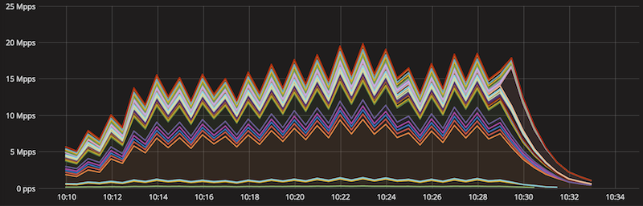
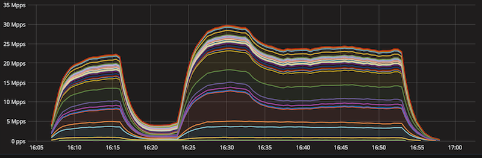

<%inherit file="basecomment.html"/>
<%block filter="filters.markdown">

-------------

I've published an article on the CloudFlare blog:

 * [https://blog.cloudflare.com/reflections-on-reflections/](https://blog.cloudflare.com/reflections-on-reflections/)

-------------


<%doc>

Recently [Akamai published an article about CLDAP](https://www.akamai.com/us/en/about/our-thinking/threat-advisories/connection-less-lightweight-directory-access-protocol-reflection-ddos-threat-advisory.jsp) reflection attacks. This got us thinking. We noticed attacks from [Conectionless LDAP](https://ldapscan.shadowserver.org/) servers back in November 2016 but we totally ignored them. We decided to look through our logs and share some statistics about reflection attacks we see regularly. In this blog post I'll show popular reflection attacks, explain how to protect from them and why Cloudflare is immune to most of it.

A recipe for reflection
----------------


Let's start with a brief reminder on how reflection attacks (often called "amplification attacks") work.

To bake a reflection attack, the villain needs four ingredients:

 - A server capable of performing [IP address spoofing](https://en.wikipedia.org/wiki/IP_address_spoofing).
 - A protocol vulnerable to reflection / amplification. Any badly designed UDP based request-response protocol will do.
 - A list of "reflectors": servers that support the vulnerable protocol.
 - A victim IP address.

The general idea:

 - The villain sends fake UDP requests.
 - The source IP address in these packets is spoofed: the attacker sticks the victim's IP address in the source IP address field, not their own IP address as they normally would.
 - Each packet is destined to a random reflector server.
 - The spoofed packets traverse the internet and eventually are delivered to the reflector server.
 - The reflector server receives the fake packet. It looks at it carefully and thinks: "Oh, what a nice request from *the victim*! I must be polite and respond!". It sends the response with all the good will.
 - The response though, is directed to the victim.

The victim will end up receiving a large volume of response packets it never had requested. With a large enough attack the victim may end up with congested network and [an interrupt storm](https://en.wikipedia.org/wiki/Interrupt_storm).

The responses delivered to victim might be larger than the spoofed requests. A carefully mounted attack may amplify the villain's traffic. In the past [we've documented a 300Gbps attack](https://blog.cloudflare.com/the-ddos-that-almost-broke-the-internet/) generated with an estimated 27Gbps of spoofing capacity.

Popular reflections
-------------------

During the last six months our DDoS mitigation system "Gatebot" detected 6329 simple reflection attacks. Here is the list of popularity of different attack vectors. An attack is defined as a large flood of packets identified by a tuple: (Protocol, Source Port, Target IP). Basically - flood of packets with the same source port to single target. This notation is pretty accurate - during normal Cloudflare operation, incoming packets rarely share a source port number!

```
  Count  Proto  Src port
   3774   udp    123        NTP
   1692   udp    1900       SSDP
    438   udp    0          IP fragmentation
    253   udp    53         DNS
     42   udp    27015      Steam?
     20   udp    19         Chargen
     19   udp    20800      Call Of Duty
     16   udp    161        SNMP
     12   udp    389        CLDAP
     11   udp    111        Sunrpc
     10   udp    137        Netbios
      6   tcp    80         HTTP
      5   udp    27005      Steam?
      2   udp    520        RIP
```


Source port 123/udp NTP
-----------------------

By far the most popular reflection attack vector remains NTP. We blogged about NTP in the past:

 * [Understanding and mitigating NTP-based DDoS attacks](https://blog.cloudflare.com/understanding-and-mitigating-ntp-based-ddos-attacks/)
 * [Technical Details Behind a 400Gbps NTP Amplification DDoS Attack](https://blog.cloudflare.com/technical-details-behind-a-400Gbps-ntp-amplification-ddos-attack/)
 * [Good News: Vulnerable NTP Servers Closing Down](https://blog.cloudflare.com/good-news-vulnerable-ntp-servers-closing-down/)

Over the last six months we've seen 3374 unique NTP amplification attacks. Most of them were short. The average attack duration was 11 minutes, with the longest lasting 22 hours (1300 minutes). Here's a histogram showing the distribution of NTP attack duration:

```
Minutes min:1.00 avg:10.51 max:1297.00 dev:35.02 count:3774
Minutes:
 value |-------------------------------------------------- count
     0 |                                                   2
     1 |                                                 * 53
     2 |                         ************************* 942
     4 |************************************************** 1848
     8 |                                   *************** 580
    16 |                                             ***** 221
    32 |                                                 * 72
    64 |                                                   35
   128 |                                                   11
   256 |                                                   7
   512 |                                                   2
  1024 |                                                   1
```

Most of the attacks used a small number of reflectors - we've recorded an average of 1.5k unique IPs. The largest attack used an estimated 12.3k reflector servers.

```
Unique IPs min:5.00 avg:1552.84 max:12338.00 dev:1416.03 count:3774
Unique IPs:
 value |-------------------------------------------------- count
     0 |                                                   0
     1 |                                                   0
     2 |                                                   0
     4 |                                                   2
     8 |                                                   0
    16 |                                                   0
    32 |                                                   1
    64 |                                                   8
   128 |                                             ***** 111
   256 |                         ************************* 553
   512 | ************************************************* 1084
  1024 |************************************************** 1093
  2048 |                   ******************************* 685
  4096 |                                        ********** 220
  8192 |                                                   13
```

The peak attack bandwidth was on average 5.76Gbps and max of 64Gbps:

```
Peak bandwidth in Gbps min:0.06 avg:5.76 max:64.41 dev:6.39 count:3774
Peak bandwidth in Gbps:
 value |-------------------------------------------------- count
     0 |                                            ****** 187
     1 |                             ********************* 603
     2 |************************************************** 1388
     4 |                     ***************************** 818
     8 |                                ****************** 526
    16 |                                           ******* 212
    32 |                                                 * 39
    64 |                                                   1
```

This stacked chart shows the geographical distribution of the largest NTP attack we've seen in the last six months. You can see the packets per second number directed to each datacenter. One our datacenters (San Jose to be precise) received about a third of the total the attack volume, while the remaining packets were distributed roughly evenly across other datacenters.



The attack lasted 20 minutes, used 527 reflector NTP servers and generated about 20M pps / 64 Gbps in peak.

Dividing these numbers we can estimate that a single packet in that attack had on average size of 400 bytes. In fact, in almost all NTP attacks we see that the great majority of attack packets of a length of precisely 468 bytes (less often 516). Here's a snippet from tcpdump:

```
$ tcpdump -n -r 3164b6fac836774c.pcap -v -c 5 -K
11:38:06.075262 IP -(tos 0x20, ttl 60, id 0, offset 0, proto UDP (17), length 468)
    216.152.174.70.123 > x.x.x.x.47787:  [|ntp]
11:38:06.077141 IP -(tos 0x0, ttl 56, id 0, offset 0, proto UDP (17), length 468)
    190.151.163.1.123 > x.x.x.x.44540:  [|ntp]
11:38:06.082631 IP -(tos 0xc0, ttl 60, id 0, offset 0, proto UDP (17), length 468)
    69.57.241.60.123 > x.x.x.x.47787:  [|ntp]
11:38:06.095971 IP -(tos 0x0, ttl 60, id 0, offset 0, proto UDP (17), length 468)
    126.219.94.77.123 > x.x.x.x.21784:  [|ntp]
11:38:06.113935 IP -(tos 0x0, ttl 59, id 0, offset 0, proto UDP (17), length 516)
    69.57.241.60.123 > x.x.x.x.9285:  [|ntp]
```


Source port 1900/udp SSDP
-----------------------


The second most popular reflection attack was [SSDP](https://en.wikipedia.org/wiki/Simple_Service_Discovery_Protocol), with a count of 1692 unique events. These attacks were using much larger fleets of reflector servers. On average we've seen around 100k reflectors used in each attack, with the largest attack using 1.23M reflector IPs. Here's the histogram of number of unique IPs used [in SSDP attacks](https://www.us-cert.gov/ncas/alerts/TA14-017A):

```
Unique IPs min:15.00 avg:98272.02 max:1234617.00 dev:162699.90 count:1691
Unique IPs:
   value |-------------------------------------------------- count
       0 |                                                   0
       1 |                                                   0
       2 |                                                   0
       4 |                                                   0
       8 |                                                   1
      16 |                                                   1
      32 |                                                   0
      64 |                                                   0
     128 |                                                   0
     256 |                                                   0
     512 |                                                   4
    1024 |                                  **************** 98
    2048 |                          ************************ 152
    4096 |                     ***************************** 178
    8192 |                         ************************* 158
   16384 |                      **************************** 176
   32768 |           *************************************** 243
   65536 |************************************************** 306
  131072 |              ************************************ 225
  262144 |                                   *************** 95
  524288 |                                           ******* 47
 1048576 |                                                 * 7
```

The attacks were also longer, with 24 minutes average duration:

```
$ cat 1900-minutes| ~/bin/mmhistogram -t "Minutes"
Minutes min:2.00 avg:23.69 max:1139.00 dev:57.65 count:1692
Minutes:
 value |-------------------------------------------------- count
     0 |                                                   0
     1 |                                                   10
     2 |                                 ***************** 188
     4 |                  ******************************** 354
     8 |************************************************** 544
    16 |                   ******************************* 342
    32 |                                   *************** 168
    64 |                                              **** 48
   128 |                                                 * 19
   256 |                                                 * 16
   512 |                                                   1
  1024 |                                                   2
```

Interestingly the bandwidth doesn't follow [normal distribution](https://en.wikipedia.org/wiki/Normal_distribution). The average SSDP attack was 12Gbps and the largest just shy of 80Gbps:

```
$ cat 1900-Gbps| ~/bin/mmhistogram -t "Bandwidth in Gbps"
Bandwidth in Gbps min:0.41 avg:11.95 max:78.03 dev:13.32 count:1692
Bandwidth in Gbps:
 value |-------------------------------------------------- count
     0 |                   ******************************* 331
     1 |                             ********************* 232
     2 |                            ********************** 235
     4 |                                   *************** 165
     8 |                                            ****** 65
    16 |************************************************** 533
    32 |                                       *********** 118
    64 |                                                 * 13
```

Let's take a closer look at the largest (80Gbps) attack we've recorded. Here's a stacked chart showing packets per second going to each datacenter. This attack was using 940k reflector IPs, generated 30M pps. The datacenters receiving the largest proportion of the traffic were San Jose, Los Angeles and Moscow.



The average packet size was 300 bytes. Here's how the attack looked on the wire:

```
$ tcpdump -n -r 4ca985a2211f8c88.pcap -K -c 7
10:24:34.030339 IP - 219.121.108.27.1900 > x.x.x.x.25255: UDP, length 301
10:24:34.406943 IP - 208.102.119.37.1900 > x.x.x.x.37081: UDP, length 331
10:24:34.454707 IP - 82.190.96.126.1900 > x.x.x.x.25255: UDP, length 299
10:24:34.460455 IP - 77.49.122.27.1900 > x.x.x.x.25255: UDP, length 289
10:24:34.491559 IP - 212.171.247.139.1900 > x.x.x.x.25255: UDP, length 323
10:24:34.494385 IP - 111.1.86.109.1900 > x.x.x.x.37081: UDP, length 320
10:24:34.495474 IP - 112.2.47.110.1900 > x.x.x.x.37081: UDP, length 288
```


Source port 0/udp IP fragmentation
----------------------------------

Sometimes we see reflection attacks showing UDP source and destination port numbers set to zero. This usually is a side effect of attacks when the servers responded with large fragmented packets.  Only the first IP fragment contains a UDP header, preventing subsequent fragments from being reported properly. From a router point of view this looks like a UDP packet without UDP header. A confused router reports a packet from source port 0, going to port 0!

This is a tcpdump-like view:

```
$ tcpdump -n -r 4651d0ec9e6fdc8e.pcap -c 8
02:05:03.408800 IP - 190.88.35.82.0 > x.x.x.x.0: UDP, length 1167
02:05:03.522186 IP - 95.111.126.202.0 > x.x.x.x.0: UDP, length 1448
02:05:03.525476 IP - 78.90.250.3.0 > x.x.x.x.0: UDP, length 839
02:05:03.550516 IP - 203.247.133.133.0 > x.x.x.x.0: UDP, length 1472
02:05:03.571970 IP - 54.158.14.127.0 > x.x.x.x.0: UDP, length 1328
02:05:03.734834 IP - 1.21.56.71.0 > x.x.x.x.0: UDP, length 1250
02:05:03.745220 IP - 195.4.131.174.0 > x.x.x.x.0: UDP, length 1472
02:05:03.766862 IP - 157.7.137.101.0 > x.x.x.x.0: UDP, length 1122
```

An avid reader will notice - the source IPs above are open DNS resolvers! Indeed, from our experience most of the attacks categorized as fragmentation are actually a side effect of DNS amplifications.

Source port 53/udp DNS
----------------------

Over the last six months we've seen 253 DNS amplifications. On average an attack used 7100 DNS reflector servers and lasted 24 minutes. Average bandwidth was around 3.4Gbps with largest attack using 12Gbps.

This is a simplification though. As mentioned above multiple DNS attacks were registered by our systems as two distinct vectors. One was categorized as source port 53, and another as source port 0. This happened when the DNS server flooded us with DNS responses larger than max packet size, usually about 1460 bytes. It's easy to see if that was the case by inspecting the DNS attack packet lengths. Here's an example:

```
DNS attack packet lengths min:44.00 avg:1458.94 max:1500.00 dev:208.14 count:40000
DNS attack packet lengths:
 value |-------------------------------------------------- count
     0 |                                                   0
     1 |                                                   0
     2 |                                                   0
     4 |                                                   0
     8 |                                                   0
    16 |                                                   0
    32 |                                                   129
    64 |                                                   479
   128 |                                                   84
   256 |                                                   164
   512 |                                                   268
  1024 |************************************************** 38876
```

The great majority of the received DNS packets were indeed close to the max packet size. This suggests the DNS responses were large and were split into multiple fragmented packets. Let's see the packet size distribution for accompanying source port 0 attack:

```
$ tcpdump -n -r 4651d0ec9e6fdc8e.pcap \
    | grep length \
    | sed -s 's#.*length \([0-9]\+\).*#\1#g' \
    | ~/bin/mmhistogram -t "Port 0 packet length" -l -b 100
Port 0 packet length min:0.00 avg:1264.81 max:1472.00 dev:228.08 count:40000
Port 0 packet length:
 value |-------------------------------------------------- count
     0 |                                                   348
   100 |                                                   7
   200 |                                                   17
   300 |                                                   11
   400 |                                                   17
   500 |                                                   56
   600 |                                                   3
   700 |                                                ** 919
   800 |                                                 * 520
   900 |                                                 * 400
  1000 |                                          ******** 3083
  1100 |              ************************************ 12986
  1200 |                                             ***** 1791
  1300 |                                             ***** 2057
  1400 |************************************************** 17785
```

About half of the fragments were large, close to max packet length in size, and rest were just shy of 1200 bytes. This makes sense: a typical max DNS response is capped at 4096 bytes. 4096 bytes would be seen on the wire as one DNS packet fragment with an IP header, one max length packet fragment and one fragment of around 1100 bytes:

```
4096 = 1460+1460+1060
```

For the record, the particular attack illustrated here used about 17k reflector server IPs, lasted 64 minutes, generated about 6Gbps on the source port 53 strand and 11Gbps in the source port 0 fragments.

We blogged about DNS reflection attacks in the past:

 * [How to Launch a 65Gbps DDoS, and How to Stop One](https://blog.cloudflare.com/65Gbps-ddos-no-problem/)
 * [Deep Inside a DNS Amplification DDoS Attack](https://blog.cloudflare.com/deep-inside-a-dns-amplification-ddos-attack/)
 * [How the Consumer Product Safety Commission is (Inadvertently) Behind the Internet’s Largest DDoS Attacks](https://blog.cloudflare.com/how-the-consumer-product-safety-commission-is-inadvertently-behind-the-internets-largest-ddos-attacks/)a


Other protocols
---------------

We've seen amplification using other protocols. We've seen:

 - port 19 - Chargen
 - port 27015 - Steam
 - port 20800 - Call Of Duty

...and many other obscure protocols. These attacks were usually small and not notable. We didn't see enough of then to provide meaningful statistics.

Poor observability
----------------

Unfortunately we're not able to report on the contents of the attack traffic. This is notable for the NTP and DNS amplifications - without case by case investigations we can't report what responses were actually being delivered to us.

This is because all these attacks stopped at our routers. Routers are heavily optimized to perform packet forwarding and have a limited capacity of extracting raw packets. Basically there is no "tcpdump" there. We track these attacks with netflow, and we observe them hit our routers firewall. The tcpdump snippets shown above were actually fake, reconstructed artificially from netflow data.

Trivial to mitigate
-----------------

With properly configured firewall and sufficient network capacity it's trivial to block the reflection attacks.

Properly configuring firewall is not rocket science. Default DROP can get you quite far. In other cases you might want to configure ratelimiting rules. This is a snippet from our JunOS config:

```
term RATELIMIT-SSDP-UPNP {
    from {
        destination-prefix-list {
            ANYCAST;
        }
        next-header udp;
        source-port 1900;
    }
    then {
        policer SA-POLICER;
        count ACCEPT-SSDP-UPNP;
        next term;
    }
}
```

But properly configuring firewall requires some internet hygiene. You should avoid using the same IP for inbound and outbound traffic. For example, filtering a potential NTP DDoS will be harder if you can't just block inbound port 123 indiscriminately. If your server requires NTP, make sure it exits to the internet over non-server IP address!

Capacity game
-------------

While having sufficient network capacity is necessary, you don't need to be a Tier 1 to survive amplification DDoS. The median attack size we've received was just 3.35Gbps, average 7Gbps, Only 195 attacks out of 6353 attacks recorded - 3% - were larger than 30Gbps.

```
All attacks in Gbps: min:0.04 avg:7.07 med:3.35 max:78.03 dev:9.06 count:6353
All attacks in Gbps:
 value |-------------------------------------------------- count
     0 |                                  **************** 658
     1 |                         ************************* 1012
     2 |************************************************** 1947
     4 |                    ****************************** 1176
     8 |                                  **************** 641
    16 |                               ******************* 748
    32 |                                              **** 157
    64 |                                                   14
```

Not all Cloudflare datacenters have 100Gbps of network capacity though. So how can we manage?

Cloudflare [was architected to withstand large attacks](https://blog.cloudflare.com/how-cloudflares-architecture-allows-us-to-scale-to-stop-the-largest-attacks/). We are able to spread the traffic on two layers:

 - Our public network uses [Anycast](https://blog.cloudflare.com/a-brief-anycast-primer/). For certain attack types - like amplification - this allows us [to split the attack](https://blog.cloudflare.com/cloudflares-architecture-eliminating-single-p/) across multiple datacenters avoiding a single choke point.
 - Additionally we use [ECMP](https://blog.cloudflare.com/path-mtu-discovery-in-practice/) internally to spread a traffic destined to single IP address across multiple physical servers.

In the examples above I shown a couple of amplification attacks getting nicely distributed across dozens of datacenters across the globe. In the shown attacks, if our router firewall failed, our physical servers wouldn't receive more than 500k pps of attack data. A well tuned iptables firewall should be able to cope with such a volume without [any special kernel offload](https://blog.cloudflare.com/kernel-bypass/) help.


Flowspec for the rest
---------------------

Withstanding reflection attacks requires sufficient network capacity. Internet citizens not having it should use a good ISP supporting [flowspec](https://tools.ietf.org/html/rfc5575).

Flowspec can be thought of as a protocol enabling firewall rules to be transmitted over a BGP session. In theory flowspec allows BGP routers on different Autonomous Systems to share simple ACL firewall rules. The flowspec rule can be configured on the attacked router and with the BGP magic it will be distributed to the ISP network to stop the packets closer to the source. This can effectively relieve network congestion.

Unfortunately, due to performance concerns only a few large ISP's allow inter-AS flowspec rules. Still - it's worth a try. Check if your ISP is willing to accept flowspec from your router!

At Cloudflare we maintain an inter-AS flowspec infrastructure, [and we have plenty of war stories](https://blog.cloudflare.com/todays-outage-post-mortem-82515/) about it.


Summary
-------

In this blog post we've shown details of three popular reflection attack vectors: NTP, SSDP and DNS. We discussed how the Cloudflare Anycast network helps us avoiding a single choke point. In most cases dealing with reflection attacks is not rocket science though - sufficient network capacity and simple firewall rules are usually enough to cope with most of the reflection attacks.

</%doc>

</%block>


