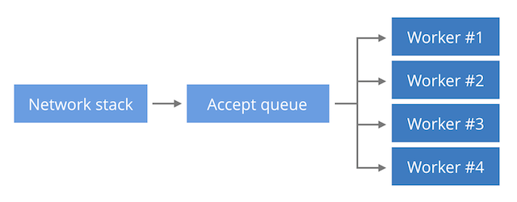
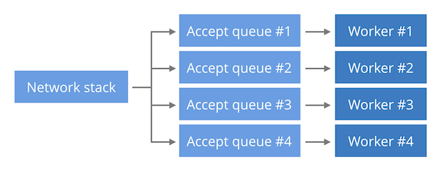

<%inherit file="basecomment.html"/>
<%block filter="filters.markdown">

-------------

I've published an article on the Cloudflare blog:

 * [https://blog.cloudflare.com/the-sad-state-of-linux-socket-balancing/](https://blog.cloudflare.com/the-sad-state-of-linux-socket-balancing/)

-------------

<%doc>

The sad state of Linux socket balancing
---------------------------------------

Scaling up TCP servers is usually straightforward. Most deployments
start by using a single worker process setup. When the need arises
more workers can be added as needed. This is a scalability model for
many applications, like HTTP servers, for example Apache, Nginx or
Lighttpd.

Increasing the number of worker processes is a great way of overcoming
a single process CPU bottleneck, but opens a whole new set of
problems.

There are generally three ways to design a TCP server with regard for
performance:


(a) **Single listen socket, single worker process.** This is the
simplest model, where processing is limited to single CPU. A single
worker process is doing both accept() calls for new connections and
processing of the requests. This model is the preferred Lighttpd setup.



(b) **Single listen socket, multiple worker process.** The new TCP
connections sit in a single kernel data structure (listen socket), but
multiple workers doing both the accept() and processing of the
requests. This model allows somewhat to spread the inbound connections
across multiple CPU's. This is the standard model for nginx.



(c) **Separate listen socket for each worker process.** With tuning of
SO_REUSEPORT socket option it's possible to have a dedicated kernel
data structure (listen socket) for each worker process. This can avoid
kernel listen socket contention, but this really isn't an issue unless
you run at Google scale.


At Cloudflare we run Nginx, and we are most familiar with the (b)
model. In this blog post we'll describe specific issue about this
model, but let's start from the beginning.

Spreading the accept() load
------------------------

Not many people realize that there are two different ways of spreading
the accept() load across multiple processes. Consider these two code
snippets. Let's call the first one *blocking-accept*. It's best
described with this pseudo code:

```.py
sd = bind(('127.0.0.1', 1024))
for i in range(3):
    if os.fork () == 0:
        while True:
            cd, _ = sd.accept()
            cd.close()
            print i
```

The idea is to share an accept queue, by calling blocking accept() in
multiple worker processes concurrently.

The second model should b called *epoll-and-accept*:

```.py
sd = bind(('127.0.0.1', 1024))
sd.setblocking(False)
for i in range(3):
    if os.fork () == 0:
        ed = select.epoll()
        ed.register(sd, EPOLLIN | EPOLLEXCLUSIVE)
        while True:
            ed.poll()
            cd, _ = sd.accept()
            cd.close()
            print i
```

The intention is to have a dedicated epoll in each worker, and call
non-blocking accept() only when epoll reports some new connections in
the accept queue shared between workers.

([Full code is available here](https://github.com/cloudflare/cloudflare-blog/blob/master/2017-11-accept-balancing))

While these programs look similar, their behavior differs
subtly[^1]. Let's see what happens when we establish a couple of
connections to each:

```.sh
$ ./blocking-accept.py
2
1
0
2
1
0
$ ./epoll-and-accept.py
0
0
0
0
0
0
```

The *blocking-accept* model distributed connections across all
workers. Each of the workers got exactly 2 connections. The
*epoll-and-accept* model on the other hand forwarded all the
connections to the first worker. The remaining workers got no
connections to handle.

It might catch you at surprise, but Linux does different load balancing
in both cases.

In the first one Linux will do proper FIFO-like round robin load
balancing. Each process waiting on accept() is added to a queue and
they will be served connections in order.

In the *epoll-and-accept* the load balancing algorithm is different.
Linux seem to choose last added process - a LIFO-like behavior. The
process adding to the waiting queue most recently will get the new
connection.If you think about it this behavior causes the busiest
process, the one that only just went back to event loop, to receive
the majority of the new connections. Therefore, the busiest worker is
likely to get most of the load.

In fact, this is what we in Nginx. One worker taking most of the load,
while others are relatively underutilized:


Notice the last worker which got almost no load, while the busiest is
using 30% of CPU.

REUSEPORT to the rescue
-----------

Linux supports a feature to work around this problem. If load
balancing across workers is an issue, user might use SO\_REUSEPORT
socket option.  This is the (c) model, when we can split the incoming
connections into multiple separate accept queues, ideally one for each
worker process.


Since the accept queues are not shared, each worker gets statistically
the same number of incoming connections, resulting in much better
balancing of the load. Each worker gets roughly similar amount of
traffic to handle:


Here all the workers are doing some work, with the busiest at 13.2%
CPU while the least busy uses 9.3%.

This is better, however, the balancing of the load is not the end of
the story. Sharding accept queue worsens average latency in some
circumstances. It's best explained by The Engineer guy:


<div>
<iframe width="640" height="356" src="https://www.youtube.com/embed/F5Ri_HhziI0?start=118" frameborder="0" allowfullscreen></iframe>
</div>

I call this problem - the Waitrose vs Tesco Superstore cashiers. The
Waitrose "combined queue model" is better at reducing the maximum
latency, while the Tesco Superstore model of separate queues to each
cashier might increase general throughput.

In our case, the (b) single accept queue while not balancing load
evenly is better for latency in a case of increased load. We can
reproduce this by running a synthetic benchmark. Here is the latency
distribution for 100k relatively CPU-intensive HTTP requests, with
HTTP keepalives disabled, concurrency set to 200 and running against a
shared-queue (b) nginx:

```.sh
$ ./benchhttp -n 100000 -c 200 -r target:8181 http://a.a/
        | cut -d " " -f 1
        | ./mmhistogram -t "Duration in ms (shared queue)"
min:3.61 avg:30.39 med=30.28 max:72.65 dev:1.58 count:100000
Duration in ms (shared queue):
 value |-------------------------------------------------- count
     0 |                                                   0
     1 |                                                   0
     2 |                                                   1
     4 |                                                   16
     8 |                                                   67
    16 |************************************************** 91760
    32 |                                              **** 8155
    64 |                                                   1
```

As you can see the latency is very predictable. The median is almost
equal to the average and standard deviation is perfectly small.

Here is the same test running against SO_REUSEPORT multi-queue nginx setup (c):

```.sh
$ ./benchhttp -n 100000 -c 200 -r target:8181 http://a.a/ 
        | cut -d " " -f 1
        | ./mmhistogram -t "Duration in ms (multiple queues)"
min:1.49 avg:31.37 med=24.67 max:144.55 dev:25.27 count:100000
Duration in ms (multiple queues):
 value |-------------------------------------------------- count
     0 |                                                   0
     1 |                                                 * 1023
     2 |                                         ********* 5321
     4 |                                 ***************** 9986
     8 |                  ******************************** 18443
    16 |    ********************************************** 25852
    32 |************************************************** 27949
    64 |                              ******************** 11368
   128 |                                                   58
```

The average is comparable, the median dropped, the max value
significantly increased, and most importantly the deviation is now
gigantic!

The latency distribution is all over the place - it's not something
you want to have on a production server.

([Instructions to reproduce the test are here.](https://github.com/cloudflare/cloudflare-blog/blob/master/2017-11-accept-balancing))

Take this benchmark with a grain of salt though. We try to generate
substantial load in order to prove the point. Depending on your setup
it might be possible to shield the server from excessive traffic and
prevent it from entering this degraded-latency state.


Conclusion
----------

Balancing the incoming connections across multiple application workers
is far from solved problem. The shared queue approach (b) scales well
and keeps the max latency in check, but due to the epoll LIFO
behavior the workers load won't be balanced.

Workloads that require even balancing might want to use REUSEPORT
pattern (c). Unfortunately in high load situations the latency could
suffer.

In general, the best generic solution seem to be to change the
standard epoll behavior from LIFO to FIFO. There have been attempts
to address this in the past by Jason Baron from Akamai
([1](https://patchwork.kernel.org/patch/5803291/),
[2](https://patchwork.kernel.org/patch/5841231/),
[3](https://www.mail-archive.com/linux-kernel@vger.kernel.org/msg831609.html)),
but none had landed in mainline so far.


[^1]: Of course comapring blocking accept with a full featured epoll
event loop is not fair. Epoll is more powerful and allows to write
event driven programs, while using blocking accept would require
careful mutli-threading programming, with dedicated thread per
request.

[^2]: Another surprise lurking in the corner - using blocking accept()
on Linux is technically incorrect! Alan Burlison pointed out that
calling
[close() on socket that has blocking accepts() will fail to inrerrupt them](https://www.mail-archive.com/netdev@vger.kernel.org/msg83683.html). This
can result in pretty buggy behaviour - you may get
[a successful accept() on a socket that no longer exits](https://bugzilla.kernel.org/show_bug.cgi?id=106241). When
in doubt - avoid using blocking accept() in multithreaded progams.


</%doc>

</%block>


