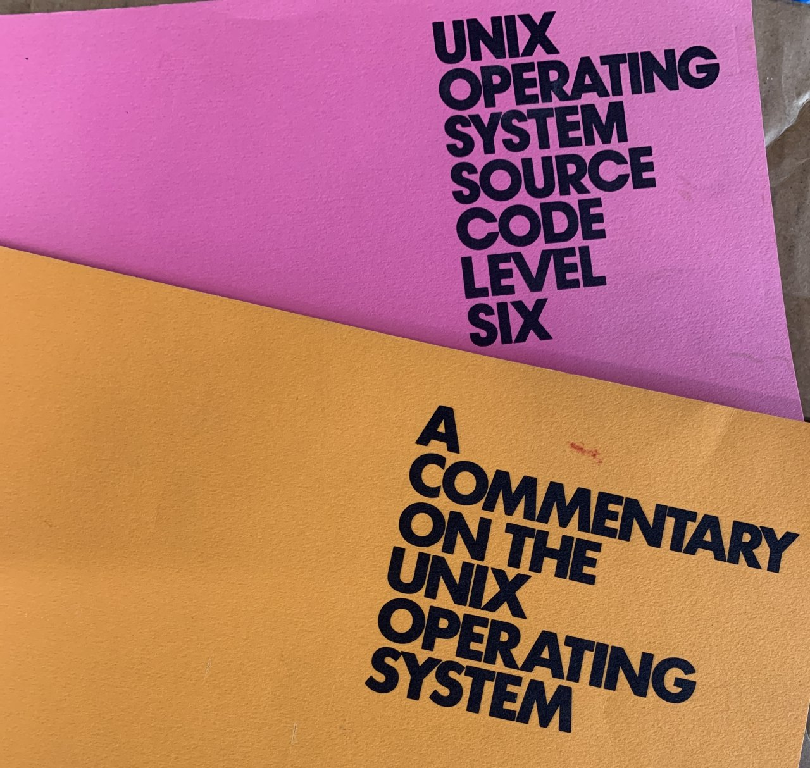
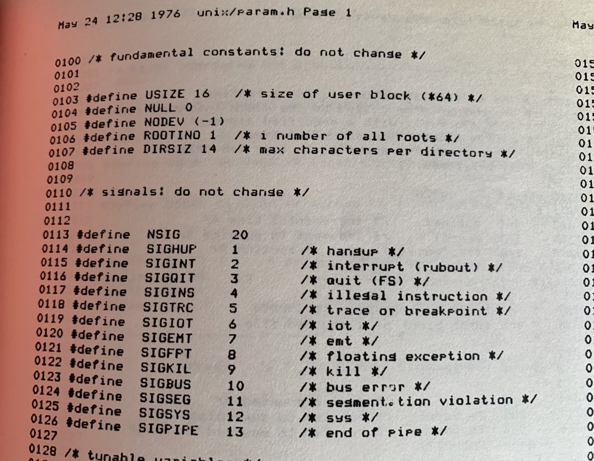

<%inherit file="basecomment.html"/>
<%block filter="filters.markdown">

-------------

This article is also co-published on [Cloudflare blog](https://blog.cloudflare.com/):

 * [Why is there a "V" in SIGSEGV Segmentation Fault?](https://blog.cloudflare.com/why-is-there-a-v-in-sigsegv-segmentation-fault/)

-------------

<div class="image"><a href="a.jpg"></a></div>

Another long night. I was working on my perfect, bug-free program in C, when the predictable thing happened:

```.bash
$ clang skynet.c -o skynet
$ ./skynet.out 
Segmentation fault (core dumped)
```

Oh, well... Maybe I'll be more lucky taking over the world another night. But then it struck me. My program received a SIGSEGV signal and crashed with "Segmentation Fault" message. Where does the "V" come from? 

Did I read it wrong? Was there a "Segmentation *V*ault?"? Or did Linux authors make a mistake? Shouldn't the signal be named SIGSEGF? 

I asked my colleagues and [David Wragg](https://twitter.com/dwragg) quickly told me that the signal name stands for "Segmentation Violation". I guess that makes sense. Long long time ago, computers used to have [memory segmentation](https://en.wikipedia.org/wiki/X86_memory_segmentation). Each memory segment had defined length - called Segment Limit. Accessing data over this limit caused a processor fault. This error code got re-used [by newer systems that used paging](https://en.wikipedia.org/wiki/Memory_segmentation#Segmentation_with_paging). I think the Intel manuals call this error ["Invalid Page Fault"](https://en.wikipedia.org/wiki/Page_fault#Invalid). When it's triggered it gets reported to the userspace as a SIGSEGV signal. End of story.

Or is it?

[Martin Levy](https://twitter.com/mahtin) pointed me to an ancient [Version 6th UNIX documentation on "signal"](http://man.cat-v.org/unix-6th/2/signal). This is from around 1978. We can clearly read that signal 11 is "Segmentation Violation". Great. But then digging deeper into the famous Unix pink and orange books:

<div class="image"><a href="b.jpg"></a></div>

Look carefully. There is no SIGSEGV signal! Signal number 11 is called SIGSEG!

It seems that userspace parts of the UNIX tree (i.e. /usr/include/signal.h) switched to SIGSEGV fairly early on. But the kernel internals continued to use the name SIGSEG for much longer. 

Looking deeper David found that PDP11 trap vector used wording ["segmentation violation"](https://github.com/dspinellis/unix-history-repo/blob/Research-V4-Snapshot-Development/sys/ken/low.s#L59). This shows up in Research V4 Edition in the UNIX history repo, but it doesn't mean it was introduced in V4 - it's just because V4 is the first version with code still available.

This trap was converted into [SIGSEG signal in trap.c](https://github.com/dspinellis/unix-history-repo/blob/Research-V4-Snapshot-Development/sys/ken/trap.c#L73) file. 

The file /usr/include/signal.h appears in the tree for Research V7, [with the name SIGSEGV](https://github.com/dspinellis/unix-history-repo/blob/Research-V7-Snapshot-Development/usr/include/signal.h). But the kernel [still called it SIGSEG at the time](https://github.com/dspinellis/unix-history-repo/blob/Research-V7-Snapshot-Development/usr/sys/sys/trap.c#L177)

It seems the kernel side was [renamed to SIGSEGV in BSD-4](https://github.com/dspinellis/unix-history-repo/blob/BSD-4/usr/src/sys/sys/trap.c#L67). 

Here you go. Originally the signal was called SIGSEG. It was subsequently renamed SIGSEGV in the userspace and a bit later - around 1980 -  to SIGSEGV on the kernel side. Apparently there are still no Segmentation Vaults found on UNIX systems.

As for my original crash, I fixed it - of course - by catching the signal and jumping over the offending instruction. On Linux it is totally possible to catch and handle SIGSEGV. With that fix, my code will never again crash. For sure.

```.c
#define _GNU_SOURCE
#include <signal.h>
#include <stdio.h>
#include <ucontext.h>

static void sighandler(int signo, siginfo_t *si, void* v_context)
{
    ucontext_t *context = v_context;
    context->uc_mcontext.gregs[REG_RIP] += 10;
}

int *totally_null_pointer = NULL;

int main() {
    struct sigaction psa;
    psa.sa_sigaction = sighandler;
    sigaction(SIGSEGV, &psa, NULL);

    printf("Before NULL pointer dereference\n");
    *totally_null_pointer = 1;
    __asm__ __volatile__("nop;nop;nop;nop;nop;nop;nop;nop;nop;nop;");
    printf("After NULL pointer. Still here!\n");

    return 0;
}
```

</%block>
