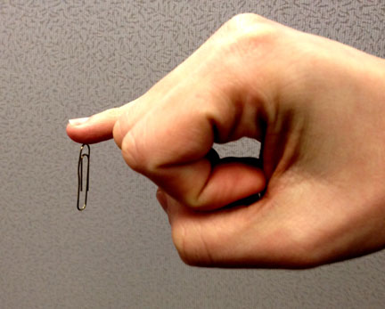
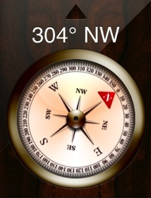
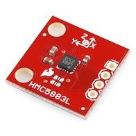
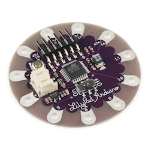
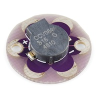
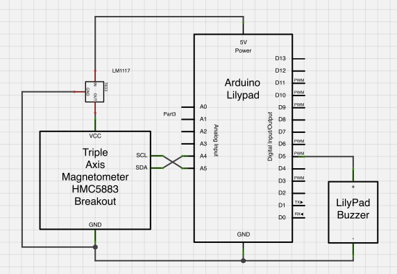
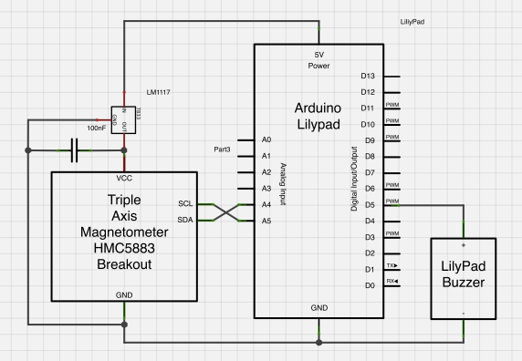
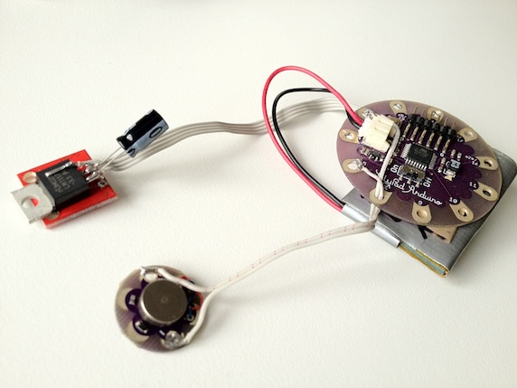
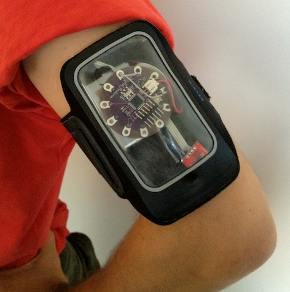

<%inherit file="base.html"/>


<article>
<%block filter="filters.markdown">

${title}
====================================

<div class="date">${date.strftime('%d %B %Y')}</div>

Some time ago I've read about a guy that had
[a magnet implanted in the pinky finger](http://www.iamdann.com/2012/03/21/my-magnet-implant-body-modification).

<div class="image" style="height:392px;">
<div>(<a href="http://www.iamdann.com/2012/03/21/my-magnet-implant-body-modification">source</a>)</div></div>

The author seems to have made the implant mostly for fun only later he
discovered that it sometimes "ticks" in and gives a "sixth sense":

> When people discuss magnet implants giving a “sixth sense,” this is
> what they’re talking about. I was working retail at the time, and I
> believe the first thing I noticed was the vibrations from the fan
> inside the cash register.

Later he discoverers more things about the environment:

> The best part of having the magnet implant was discovering invisible
> magnetic fields when I wasn’t actually looking. The first experience
> I had with this was walking through the intersection of Broadway and
> Bleecker in Manhattan. I passed through this intersection a few
> times before realizing that my finger would tingle at a certain
> spot. After paying a bit more attention, I realized that I was
> feeling something underground. At first, I assumed it was a subway
> car, but later came to the conclusion that it was most likely the
> subway power generator, or the giant fan that was cooling these
> generator.

Having a sixth sense sounds exciting, but implanting a piece of metal
in your body is quite invasive. Even ignoring such details like
finding a surgeon willing to perform the operation, the prospects of
a possible magnet corrosion and
[not being able to get an MRI scan](http://news.ycombinator.com/item?id=3734200)
are major downsides.

Deciding that an implant may not be for me I started to wonder: why
not to try "emulate" the thing? Of course, any kind of "emulation" is
inferior to real sensation in your finger, but at least I will be able
to figure out if the whole idea is worthwhile without cutting myself.

Tinkering mode: ON
------------------

Devices that are used to detect magnetic fields are called
[magnetometers](https://en.wikipedia.org/wiki/Magnetometer). They are
quite common spread - detecting magnetic field direction is exactly
what compasses do. And most likely you have one in your phone.

<div class="image" style="height:364px;"></div>

Having previously played with Arduino I thought about building a very
simple device that could be worn and would notify the user about
magnetic field fluctuations.

From Dann's post I understand that he can only sense field
fluctuations, but having a computer I'm able to detect more
sophisticated changes in the field.

Hardware setup
--------------

So I decided to start simple - Arduino, with a magnetometer connected
to it and a simple buzzer. I decided to re-use my iPod armband and
wear the device on my left arm. The device will count the absolute
strength of the magnetic field and if it is stronger than threshold
inform me with the buzzer. I guess that's called
[wearable computing](https://en.wikipedia.org/wiki/Wearable_computing)
nowadays :)

${"###"} Magnetometer


I'm not an electrical engineer, even simple tasks like getting data
from the magnetometer might be problematic in an Arduino
world. Luckily I found a
[blog post describing an Arduino talking to a simple magnetometer](http://www.geocomputing.co.uk/getpage.php?type=page&page=ppcmagnetest). The
magnetometer unit in use is
[HMC6352](https://www.sparkfun.com/products/7915). For $35 it's
expensive - but at least it's very simple.

The chip is simple, works with Arduino out of the box and accepts input
voltage in a scale perfect for this project 2.7V - 5.2V. But
unfortunately it was not good enough for my usage - readings from only
two axis were inconsistent and I often missed interesting facts due
to the lack of the third axis.

<div class="image" style="height:224px;"></div>

My next choice was [HMC5883L](https://www.sparkfun.com/products/10530)
for $15. The decent alternative might be
[MAG3110](https://www.sparkfun.com/products/10619) for the same price
but a bit more sensitive. I chose HMC due to a better documentation,
namely this blog post:

 * http://bildr.org/2012/02/hmc5883l_arduino/
 
The big problem with those chips is voltage - both operate in around
2V - 3.6V range (not the usual 5V as in USB).

${"###"} Arduino

<div class="image" style="height:280px;"></div>

Wearing a normal
[Arduino Uno Board](http://arduino.cc/en/Main/ArduinoBoardUno) is not
practical, fortunately there are many alternatives. I chose
[Arduino LilyPad Simple](https://www.sparkfun.com/products/10274). On
hindsight [Arduino Fio](https://www.sparkfun.com/products/10116) or
[Pro Mini](https://www.sparkfun.com/products/11114) might have been
better options.

[LilyPad](http://www.arduino.cc/en/Main/ArduinoBoardLilyPad) can be
powered with either from a Li-Po battery or from an USB (FTDI)
interface. The latter is mostly useful for development. Most
importantly - LilyPad does not provide a 3.3V power output like Uno
Board does.

Our precious magnetometer HMC5883L will blow up when powered with
5V. In order to comprehend that I used a voltage regulator from
[LM1117](http://www.ti.com/lit/ds/symlink/lm1117-n.pdf) family. I got
3.3V one, as that was the only thing available in shop at a time.

With a regulator used to power magnetometer I could connect it to
LilyPad and power it either from Li-Po battery and from USB.

Oh, it's worth noting that the regulator is useful even when using
Li-Po battery as a power source - although the battery is rated as
3.7V,
[according to Wikipedia](https://en.wikipedia.org/wiki/Lithium-ion_polymer_battery)
you should expect voltage ranging from 2.7V when discharged to 4.23V
when charged.

${"###"} Buzzer

<div class="image" style="height:224px;"></div>

Sorting out the buzzer was simple - SparkFun provide
[ready-to-use buzzers](https://www.sparkfun.com/products/8463) crafted
for LilyPad.

Soldering time
--------------

To be frank, the electronics here aren't very sophisticated, here's a
schema (with power supply omitted): <div class="image"
style="height:420px;"><div>Schema</div></div>

Unfortunately this setup didn't work very well - once the buzzer was
turned on, the magnetometer stopped working. This happened only when
powered from battery (not from USB).

I suspected there might be a voltage drop when the motor in the buzzer
is started, and the magnetometer is a sensitive beast. To compensate
that I added a capacitor between the VCC and GND pins on the
HMC5883. This seems to solve the problem, but frankly - I don't know
if that's correct. I don't know if it's legal to put a capacitor
behind LM1117 regulator. Maybe the capacitor should be plugged in near
the battery. (Dear lazyweb: help!)

Updated schema:
<div class="image" style="height:420px;"><div>Schema with an extra capacitor</div></div>

The final result (including the battery):
<div class="image" style="height:448px;"><div>The result!</div></div>


Software
--------

The program for Arduino
[is available on my github](https://github.com/majek/dump/blob/master/arduino/ard-06/haemce.ino)
(but don't expect high quality software).

One of the more interesting parts is setting up the magnetometer, the
hardcoded values are taken from
[the HMC5883L datasheet](http://www51.honeywell.com/aero/common/documents/myaerospacecatalog-documents/Defense_Brochures-documents/HMC5883L_3-Axis_Digital_Compass_IC.pdf):

```
void setupHMC5883L(){
        compass.SetScale(8.1);
        compass.SetRegisterA(0, 5, 0);
        compass.SetMeasurementMode(Measurement_Continuous);
}
```

I'm not really interested in the direction of Earth's magnetic north,
only in the absolute strength of the magnetic field. To get that I'm
using the
[Euclidean distance](https://en.wikipedia.org/wiki/Euclidean_distance)
function:

```
        return sqrt(scaled.XAxis * scaled.XAxis +
                    scaled.YAxis * scaled.YAxis +
                    scaled.ZAxis * scaled.ZAxis);
```

And that's basically it. In fact the program doesn't do much:
continuously reads data from the magnetometer and if the strength of
the magnetic field goes above the threshold it turns on the buzzer
with proportional power.

The threshold must be set quite carefully to cut off
[Earth's magnetic field](https://en.wikipedia.org/wiki/Earth%27s_magnetic_field),
which is between 0.25 – 0.65 Gauss. I used the threshold of 0.7 Gauss.

Results
-------

<div class="image" style="height:532px;"><div>Am I a cyborg now?</div></div>

I wore the device for some time and it actually works. I quickly found
out that the buzzer needs to be directly touching the skin to be felt.

(Side note: wearing naked electronics may freak out people on the
streets, I don't recommend that).


When wearing the device I could feel "stuff", mostly electrical
devices. Friends were laughing at me when during a walk I was stopping
suddenly and doing few steps back to identify the source of the
magnetic field (it was usually a utility box). There were also places
where I couldn't identify the source of the field.

After all that, I agree that being able to feel the magnetic field is
a great fun.


</%block>
</article>
